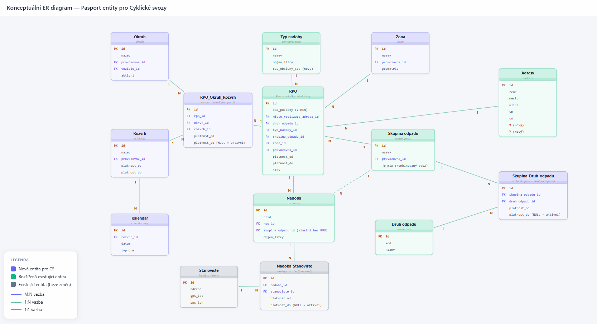

# Datový model - návrh řešení

- Page ID: 123372122
- Source URL: https://confluence.radium.cz/pages/viewpage.action?pageId=123372122

---

RedDůležitéZpracováno v Visual Studio Code

Dokument zpracován ve Visual Studio Code.

Původní dokumenty v GitHub:

- [VF_ANA_CS_PP/docs/datovy-model/datovy-model-PP.md at main · vfindejs2/VF_ANA_CS_PP](https://github.com/vfindejs2/VF_ANA_CS_PP/blob/main/docs/datovy-model/datovy-model-PP.md)
- [VF_ANA_CS_PP/docs/datovy-model/er-diagram-pasport_v1.html at main · vfindejs2/VF_ANA_CS_PP](https://github.com/vfindejs2/VF_ANA_CS_PP/blob/main/docs/datovy-model/er-diagram-pasport_v1.html)

2

# Datový model PP — Návrh řešení pro CS (Etapa 1)

**Účel:** Kompletní business analytický návrh datového modelu PP pro Cyklické svozy — entity, atributy, vazby a business pravidla.

**Vstupní podklady:**
- `01-vstupni-data-zadni/vytah-cilovy-koncept.md` — business zadání (CK v0.10)
- `02-Datovy-model-PP/hen-nove-entity-analyza.md` — analýza entit HEN (StudiaRealizovatelnosti.docx + Obec Košariská.xlsx)
- `02-Datovy-model-PP/gap-analyza-navrhu-reseni.md` — 11 identifikovaných mezer mezi návrhem a realitou HEN
- `PP-datovy-model-navrh-reseni-v1/er-diagram-pasport_v1.html` — ER diagram

**Verze:** v2 (přepracovaná)
**Aktualizováno:** 2026-04-07

---

## Společné poznámky k modelu

- Dokument popisuje **tabulky z ER diagramu**, tj. konceptuální / analytický návrh pro PP a související integrace.
- Barvy v ER:
   - modrá = nová entita pro CS
   - zelená = existující entita rozšířená pro CS
- Přerušovaná vazba v ER znamená **volitelnou / fallback** vazbu (aktuálně `Nádoba → Skupina odpadu` při absenci vazby na RPO).
- Klíčová změna proti dřívějším variantám návrhu:
   - vazby `RPO_Okruh` a `RPO_Rozvrh` jsou sjednoceny do temporální tabulky `RPO_Okruh_Rozvrh`
   - `RPO → Zóna` má kardinalitu `N:1`
   - `Stanoviště` nemá přímou vazbu na `RPO`
   - `RPO` odkazuje na `Adresy` referencí (`misto_realizace_adresa_id`)

---

## Architektonická rozhodnutí

> Tato rozhodnutí ovlivňují více entit a musí být zafixována před detailním návrhem.

### AR-01: Vazební model Okruh/Rozvrh ↔ RPO

**Problém (Gap #9):** V HEN existují dvě oddělené struktury — `Okruh trasy položky` (snapshot RPO v okruhu, bez platnosti) a přiřazení `Rozvrh ↔ Predmet` (na úrovni predmětu). Návrh PP v1 sdružuje obě vazby do jedné temporální entity `RPO_Okruh_Rozvrh`.

**Rozhodnutí:** Zachovat PP model `RPO_Okruh_Rozvrh` (Varianta A).

**Zdůvodnění:**
- PP konsoliduje dvě HEN struktury do jednoho záznamu → jednodušší správa a dotazování.
- Temporální platnost (`platnost_od/do`) umožňuje dohledatelnost změn, což HEN model nenabízí.
- Mapování z HEN: integrační vrstva složí dohromady přiřazení okruhu a rozvrhu k RPO do jednoho záznamu v PP.
- V Etapě 2+ (přechod SoT na PP) je konsolidovaný model výhodnější pro UI správu přiřazení.

**Dopad:** Entity RPO, Okruh, Rozvrh, RPO_Okruh_Rozvrh zachovávají design dle ER v1.

---

### AR-02: Model Zóny — geometrie vs. adresní definice

**Problém (Gap #5):** Návrh PP v1 obsahuje `geometrie geometry(Polygon)` na Zóně. HEN definuje zónu hierarchickou adresní podmínkou (Okres → Obec → Ulica → č.domu) bez geometrie.

**Rozhodnutí:** Geometrie v PP = odvozená vizualizační pomůcka (Varianta A). Přidat entitu `Zóna položky` pro přenos adresní definice z HEN.

**Zdůvodnění:**
- HEN je v Etapě 1 SoT pro zóny; PP musí převzít HEN model definice zóny (adresní hierarchie).
- `geometrie` na entitě Zóna bude technický/odvozený atribut pro vizualizaci na mapě — nepatří do business DS.
- Entita `Zóna položky` (`zona_polozka`) umožní přenést a zobrazit detailní definici zóny z HEN.

**Dopad:** Entita Zóna — odebrán atribut `geometrie` z business DS. Nová entita `Zóna položky`. Nová entita `Región` (číselník z HEN).

---

### AR-03: Rozvrh — modelování parametrů frekvence

**Problém (Gap #4):** HEN Rozvrh má atribut `Frekvencia` (Denne/Týždenne/Vlastné) s parametry specifickými pro každý typ. Návrh PP v1 tyto atributy nemá.

**Rozhodnutí:** Nullable sloupce přímo na entitě `Rozvrh` (Varianta A — denormalizovaný přístup).

**Zdůvodnění:**
- Typy frekvence jsou stabilní číselník (3 hodnoty) — denormalizace nezpůsobí výrazný technický dluh.
- Jednodušší dotazy a čitelný model pro Etapu 1 (PP je reader, ne editor rozvrhů).
- V Etapě 2+ lze přehodnotit při potřebě rozšíření typů frekvence.

**Dopad:** Entita Rozvrh — přidán `frekvence` + nullable parametrové sloupce.

---

## Strategie `external_id`

Každá entita synchronizovaná z HEN musí mít atribut `external_id` (nvarchar) pro jednoznačnou identifikaci záznamu v HEN. Tento atribut slouží jako **technický integrační klíč** — odlišný od business identifikátoru (`referencia`, `kod_polozky` apod.), který slouží uživatelům.

| Entita | `external_id` zdroj v HEN | Poznámka |
|---|---|---|
| RPO | číslo nonsubjektu třídy `lcs.d2b_w_predmet_zmluvy` | Kritický předpoklad celé integrace |
| Okruh | číslo nonsubjektu Okruh trasy | |
| Rozvrh | Referencia rozvrhu vývozov | |
| Kalendar | ID záznamu Dni vývozu | |
| Zóna | číslo nonsubjektu Zóna | |
| Región | Referencia regionu | |

> Integrační model (API služby, triggery synchronizace, datové kontrakty) je předmětem samostatné analýzy — v tomto dokumentu se nerozpracovává.

---

# Návrh řešení pro úpravy datového modelu Pasport

Aktuální stav: [Datový slovník](#)

## Diagram úprav

## 1. RPO

**Stav:** Existující — rozšíření pro CS
 **Role:** Centrální entita CS (revize položky objednávky), základ pro plánování, filtraci a vazby na provozní objekty.

### Klíčové atributy

- `id` (PK)
- `external_id` (číslo nonsubjektu z HEN — integrační klíč, viz strategie `external_id`)
- `kod_polozky` (z HEN — business identifikátor pro uživatele)
- `misto_realizace_adresa_id` (FK → `Adresy`)
 Pozn.: nahrazuje původní textové `misto_realizace`.
- `druh_odpadu_id` (FK → `Druh odpadu`)
- `typ_nadoby_id` (FK → `Typ nádoby`)
- `skupina_odpadu_id` (FK → `Skupina odpadu`)
- `zona_id` (FK → `Zóna`)
- `provozovna_id` (FK)
- `platnost_od`, `platnost_do`
- `stav`

### Vazby

- `RPO (N) → Zóna (1)`
- `Zóna (1) → Zóna položky (N)` (adresní definice zóny — viz sekce 15)
- `Zóna (N) → Región (1)` (kategorizace)
- `RPO (N) → Adresy (1)`
- `RPO (N) → Skupina odpadu (1)`
- `RPO (N) → Typ nádoby (1)`
- `RPO (1) → Nádoba (N)`
- `RPO (1) → RPO_Okruh_Rozvrh (N)` (historie přiřazení)

### Source of Truth (SoT)

| Etapa | SoT | PP role | Poznámka |
|---|---|---|---|
| E1 | HEN | Reader — PP přijímá RPO a vazby z HEN přes integraci | PP eviduje a zobrazuje, needituje |
| E2+ | HEN (data RPO), PP (vazby na okruh/rozvrh/zónu) | Writer vazeb — PP spravuje přiřazení RPO do okruhů/zón/rozvrhů | Změna SoT pro vazby, ne pro kmenová data RPO |
### Pravidla a poznámky

- `RPO` je nositel obchodního kontextu pro obsluhu místa realizace.
- `external_id` je technický integrační klíč (číslo nonsubjektu z HEN); `kod_polozky` je business identifikátor zobrazovaný uživateli. Obě hodnoty plní jinou roli a koexistují.
- Historie přiřazení `Okruh + Rozvrh` je vedena v `RPO_Okruh_Rozvrh`; `RPO` v aktuálním ER nenese přímý FK na „aktivní“ záznam této vazby.
- Vazba na `Stanoviště` je **nepřímá přes `Nádobu` a vazební entitu `Nadoba_Stanoviste`**.

### Businessové požadavky (z `vytah-cilovy-koncept.md`)

- `RPO` je jednoznačný podklad o způsobu obsluhy místa realizace nebo navázaných nádob.
- V Etapě 1 jsou data RPO a vazeb na okruh/rozvrh/zónu synchronizována z HEN (PP je eviduje a zobrazuje).
- `RPO` je klíčový vstup pro generování objednaných služeb v RP (obsahuje mj. adresu/souřadnice MR, druh/skupinu odpadu, okruh, rozvrh, kalendářní dny).
- Vazba `RPO → Rozvrh` je nutnou podmínkou pro vygenerování objednané služby; vazba `RPO → Okruh` určuje míru automatizace zařazení do okruhu dne.
- V dalších etapách roste význam PP jako místa správy přiřazení RPO do okruhů/zón/rozvrhů (s dopadem na plánování).

### Návrh fyzického DDL (SQL)

**Tabulka:** `rpo`

**Mapování atributů na DDL dle `inventar-entit-PP.md` (entita: Revize položky objednávky / `order_item_revision`):**

| Atribut (ER)                | DDL sloupec v inventáři PP   | Stav       | Poznámka                                                                          |
| --------------------------- | ---------------------------- | ---------- | --------------------------------------------------------------------------------- |
| `id`                        | `id`                         | nalezeno   | přímá shoda                                                                       |
| `kod_polozky`               | `order_item_id` + `revision` | částečně   | v inventáři není samostatný sloupec `kod_polozky`; ER atribut je business zkratka |
| `misto_realizace_adresa_id` | `realization_address_id`     | nalezeno   | přímá shoda významu                                                               |
| `druh_odpadu_id`            | `garbage_type_id`            | nalezeno   | přímá shoda významu                                                               |
| `typ_nadoby_id`             | `container_type_id`          | nalezeno   | přímá shoda významu                                                               |
| `skupina_odpadu_id`         | —                            | nenalezeno | CS rozšíření nad rámec inventáře RPO                                              |
| `zona_id`                   | —                            | nenalezeno | CS rozšíření nad rámec inventáře RPO                                              |
| `provozovna_id`             | —                            | nenalezeno | v inventáři DDL `order_item_revision` není přímý sloupec provozovny               |
| `platnost_od`               | `valid_from`                 | nalezeno   | přímá shoda významu                                                               |
| `platnost_do`               | `valid_to`                   | nalezeno   | přímá shoda významu                                                               |
| `stav`                      | `is_active`                  | částečně   | ER „stav“ je širší koncept než systémové `is_active`                              |

**Sloupce (návrh):**

| Položka                               | Popis |
| ------------------------------------- | ----- |
| id bigint identity primary key        | —     |
| external_id nvarchar(50) not null     | integrační klíč — číslo nonsubjektu z HEN |
| kod_polozky nvarchar(100) not null    | business identifikátor pro uživatele |
| misto_realizace_adresa_id bigint null | —     |
| druh_odpadu_id bigint null            | —     |
| typ_nadoby_id bigint null             | —     |
| skupina_odpadu_id bigint null         | —     |
| zona_id bigint null                   | —     |
| provozovna_id bigint not null         | —     |
| platnost_od datetime2(0) null         | —     |
| platnost_do datetime2(0) null         | —     |
| stav nvarchar(50) null                | —     |
| audit/tenant sloupce dle standardu PP | —     |

**FK (návrh):**

| FK sloupec                | Reference / poznámka                  |
| ------------------------- | ------------------------------------- |
| misto_realizace_adresa_id | → `adresy(id)`                        |
| druh_odpadu_id            | → `garbage_type(id)` / ekvivalent DS  |
| typ_nadoby_id             | → `typ_nadoby(id)` / ekvivalent DS    |
| skupina_odpadu_id         | → `garbage_group(id)` / ekvivalent DS |
| zona_id                   | → `zone(id)` / ekvivalent DS          |
| provozovna_id             | → `organization_unit(id)`             |

**Indexy (návrh):**

| Index                 | Definice / poznámka           |
| --------------------- | ----------------------------- |
| UX_rpo_external_id    | (`external_id`) UNIQUE        |
| IX_rpo_kod_polozky    | (`kod_polozky`)               |
| IX_rpo_provozovna     | (`provozovna_id`)             |
| IX_rpo_zona           | (`zona_id`)                   |
| IX_rpo_skupina_odpadu | (`skupina_odpadu_id`)         |
| IX_rpo_druh_odpadu    | (`druh_odpadu_id`)            |
| IX_rpo_typ_nadoby     | (`typ_nadoby_id`)             |
| IX_rpo_adresa         | (`misto_realizace_adresa_id`) |

---

## 2. Okruh

**Stav:** Nová entita pro CS
 **Role:** Seskupení RPO obsluhovaných společně; stavební kámen plánování v RP.

### Klíčové atributy

- `id` (PK)
- `external_id` (integrační klíč z HEN)
- `referencia` (business identifikátor z HEN — zadávaný uživatelem, negenerovaný)
- `nazev`
- `provozovna_id` (FK)
- `vozidlo_id` (FK, záměrné rozšíření PP nad HEN — pravidelné vozidlo pro plánování)
- `aktivni`
- `poznamka`

### Vazby

- `Okruh (1) → RPO_Okruh_Rozvrh (N)`

### Source of Truth (SoT)

| Etapa | SoT | PP role | Poznámka |
|---|---|---|---|
| E1 | HEN | Reader — PP importuje okruhy z HEN | Read-only, bez editace |
| E2+ | PP | Writer — PP zakládá, edituje a deaktivuje okruhy | SoT přechází z HEN na PP, synchronizace zpět do HEN |

### Pravidla a poznámky

- V ER je vazba na RPO realizována přes `RPO_Okruh_Rozvrh` (nikoli přímou M:N tabulkou jen pro Okruh).
- `vozidlo_id` je záměrné rozšíření PP nad rámec HEN — HEN vozidlo na okruhu neeviduje. V PP slouží k přednastavení pravidelného vozidla pro automatizaci generování DV v RP.
- Změna přiřazení okruhu na RPO se řeší historizací v `RPO_Okruh_Rozvrh`.

### Businessové požadavky (z `vytah-cilovy-koncept.md`)

- Okruh je stavební kámen operativního plánování v RP (tvorba okruhů dne / denních výkonů).
- Vazba `RPO → Okruh` je v konceptu businessově nepovinná; bez ní lze OS generovat, ale s nižší mírou automatizace zařazení.
- Etapa 1: SoT okruhů a vazeb je HEN (import do PP, read-only vazby).
- Etapa 2+: PP přebírá správu okruhů a vazeb RPO na okruhy, včetně zakládání/editace/deaktivace.
- Okruh může mít přiřazené pravidelné vozidlo, což usnadňuje generování a automatické zařazení OS do denních výkonů.

### Návrh fyzického DDL (SQL)

**Tabulka:** `okruh`

**Mapování atributů na DDL dle `inventar-entit-PP.md`:**

| Atribut (ER)                                            | DDL sloupec v inventáři PP | Stav       | Poznámka                                                                   |
| ------------------------------------------------------- | -------------------------- | ---------- | -------------------------------------------------------------------------- |
| `id`, `nazev`, `provozovna_id`, `vozidlo_id`, `aktivni` | —                          | nenalezeno | entita je v inventáři PP vedena jen jako nová CS entita bez DDL (sekce 23) |

**Sloupce (návrh):**

| Položka                               | Popis |
| ------------------------------------- | ----- |
| id bigint identity primary key        | —     |
| external_id nvarchar(50) not null     | integrační klíč z HEN |
| referencia nvarchar(50) null          | business identifikátor z HEN (zadávaný uživatelem) |
| nazev nvarchar(255) not null          | —     |
| provozovna_id bigint not null         | —     |
| vozidlo_id bigint null                | rozšíření PP nad HEN — pravidelné vozidlo |
| aktivni bit not null default 1        | —     |
| poznamka nvarchar(max) null           | —     |
| audit/tenant sloupce dle standardu PP | —     |

**FK (návrh):**

| FK sloupec    | Reference / poznámka                                 |
| ------------- | ---------------------------------------------------- |
| provozovna_id | → `organization_unit(id)`                            |
| vozidlo_id    | → `vehicle(id)` / ekvivalent DS (pokud se vede v PP) |

**Indexy (návrh):**

| Index                     | Definice / poznámka              |
| ------------------------- | -------------------------------- |
| IX_okruh_provozovna       | (`provozovna_id`)                |
| IX_okruh_aktivni          | (`aktivni`)                      |
| UX_okruh_provozovna_nazev | (`provozovna_id`, `nazev`)  |

---

## 3. Rozvrh

**Stav:** Nová entita pro CS
 **Role:** Řízení kalendářních dnů, na které se generují objednané služby z RPO.

### Klíčové atributy

- `id` (PK)
- `external_id` (integrační klíč z HEN — Referencia rozvrhu vývozov)
- `nazev` (v HEN kompozitní — automaticky sestavený z roku/týdne/dnů)
- `frekvence` (DENNI / TYDENNI / VLASTNI — viz AR-03)
- `provozovna_id` (FK)
- `platnost_od`, `platnost_do`
- Parametry frekvence (nullable, dle AR-03):
  - `start_datum` (denní: startovací datum)
  - `interval_dni` (denní: každý N-tý den)
  - `pocet_opakovani` (denní: počet opakování)
  - `dny_v_tydnu` (týdenní: vybrané dny, bitová maska nebo CSV)
  - `typ_tydne` (týdenní: PARNY / NEPARNY / VSECHNY)
  - `pocet_dni_mesic` (vlastní: počet dnů svozu na měsíc)

### Vazby

- `Rozvrh (1) → Kalendar (N)`
- `Rozvrh (1) → RPO_Okruh_Rozvrh (N)`

### Source of Truth (SoT)

| Etapa | SoT | PP role | Poznámka |
|---|---|---|---|
| E1 | HEN | Reader — PP importuje rozvrhy z HEN, read-only | Správa rozvrhů a generování kalendářů zůstává v HEN |
| E2+ | HEN (definice rozvrhů), PP (vazba RPO na rozvrh) | PP spravuje vazbu RPO → Rozvrh | Rozvrhy samotné zůstávají v HEN i v E2 |

### Pravidla a poznámky

- V ER v1 je Rozvrh v PP označen jako read-only (zdroj pravdy HEN).
- Změna přiřazení rozvrhu k RPO se historizuje v `RPO_Okruh_Rozvrh`.

### Businessové požadavky (z `vytah-cilovy-koncept.md`)

- Rozvrh řídí konkrétní kalendářní dny, na které má vzniknout objednaná služba z RPO.
- Rozvrhy a kalendářní svozy jsou v Etapě 1 spravovány v HEN; v PP jsou primárně zobrazovány.
- Rozvrh je vázán na provozovnu a pracuje s platností (businessově významný atribut).
- Vazba `RPO → Rozvrh` je podmínkou generování OS v RP.
- V dalších etapách má PP řídit vazbu RPO na rozvrh a stát se SoT pro vazby (se synchronizací do HEN).

### Návrh fyzického DDL (SQL)

**Tabulka:** `rozvrh`

**Mapování atributů na DDL dle `inventar-entit-PP.md`:**

| Atribut (ER)                                                 | DDL sloupec v inventáři PP | Stav       | Poznámka                                                                   |
| ------------------------------------------------------------ | -------------------------- | ---------- | -------------------------------------------------------------------------- |
| `id`, `nazev`, `provozovna_id`, `platnost_od`, `platnost_do` | —                          | nenalezeno | entita je v inventáři PP vedena jen jako nová CS entita bez DDL (sekce 23) |

**Sloupce (návrh):**

| Položka                               | Popis |
| ------------------------------------- | ----- |
| id bigint identity primary key        | —     |
| external_id nvarchar(50) not null     | integrační klíč — Referencia z HEN |
| nazev nvarchar(255) not null          | v HEN kompozitní (automaticky sestavený) |
| frekvence nvarchar(20) not null       | DENNI / TYDENNI / VLASTNI |
| provozovna_id bigint not null         | —     |
| platnost_od date null                 | —     |
| platnost_do date null                 | —     |
| start_datum date null                 | denní: startovací datum |
| interval_dni int null                 | denní: opakování každý N-tý den |
| pocet_opakovani int null              | denní: počet opakování |
| dny_v_tydnu nvarchar(20) null         | týdenní: bitová maska/CSV vybraných dnů |
| typ_tydne nvarchar(20) null           | týdenní: PARNY / NEPARNY / VSECHNY |
| pocet_dni_mesic int null              | vlastní: počet dnů svozu na měsíc |
| audit/tenant sloupce dle standardu PP | —     |

**FK (návrh):**

| FK sloupec    | Reference / poznámka      |
| ------------- | ------------------------- |
| provozovna_id | → `organization_unit(id)` |

**Indexy (návrh):**

| Index                      | Definice / poznámka              |
| -------------------------- | -------------------------------- |
| IX_rozvrh_provozovna       | (`provozovna_id`)                |
| IX_rozvrh_platnost         | (`platnost_od`, `platnost_do`)   |
| UX_rozvrh_provozovna_nazev | (`provozovna_id`, `nazev`)  |

---

## 4. Kalendar

**Stav:** Nová entita pro CS
 **Role:** Konkrétní kalendářní den obsluhy přiřazený k Rozvrhu.

### Klíčové atributy

- `id` (PK)
- `external_id` (integrační klíč z HEN — ID záznamu Dni vývozu)
- `rozvrh_id` (FK → `Rozvrh`)
- `datum` (date, konkrétní kalendářní den)
- `vyvoz` (boolean — ANO/NE, klíčový atribut; nahrazuje původní `typ_dne`)
- `den_v_tydnu` (text — Pondelok, Utorok, ...)
- `tyden_v_mesici` (int)
- `tyden` (int — číslo týdne v roce)
- `typ_tydne` (text — Párny / Nepárny)
- `stvrteleti` (int — číslo čtvrtletí)
- `vikend` (boolean)
- `svatek` (boolean)
- `posledni_v_mesici` (boolean)
- `poznamka` (text)

### Vazby

- `Kalendar (N) → Rozvrh (1)`

### Source of Truth (SoT)

| Etapa | SoT | PP role | Poznámka |
|---|---|---|---|
| E1 | HEN | Reader — PP přijímá kalendářní dny z HEN | Generování dnů z rozvrhu zůstává v HEN |
| E2+ | HEN | Reader | Kalendáře zůstávají v kompetenci HEN i v E2 |

### Pravidla a poznámky

- Entita reprezentuje provozní dny, ve kterých se reálně sváží.
- Klíčový atribut je `vyvoz` (boolean ANO/NE) — nahrazuje původní `typ_dne` z ER v1. V HEN je `vyvoz` přepínatelný funkcí (formulář je needitovatelný přímo).
- Atributy `den_v_tydnu`, `tyden_v_mesici`, `stvrteleti`, `tyden`, `typ_tydne`, `vikend`, `svatek`, `posledni_v_mesici` jsou v HEN počítány z `datum`. Rozhodnutí: v PP budou přenášeny z HEN jako data (ne počítány aplikačně) pro konzistenci a jednoduchost synchronizace.

### Businessové požadavky (z `vytah-cilovy-koncept.md`)

- Kalendář reprezentuje konkrétní kalendářní den obsluhy navázaný na rozvrh.
- Kalendářní dny vstupují do generování objednaných služeb v RP (OS vznikají pro dny v období generování).
- Generování OS musí zajistit, že pro stejnou kombinaci RPO/kalendářního dne nevznikne duplicitní OS.
- Kalendář je businessově odvozen od Rozvrhu (správa v kontextu rozvrhů, v CK primárně HEN).

### Návrh fyzického DDL (SQL)

**Tabulka:** `kalendar`

**Mapování atributů na DDL dle `inventar-entit-PP.md`:**

| Atribut (ER)                          | DDL sloupec v inventáři PP | Stav       | Poznámka                                                                   |
| ------------------------------------- | -------------------------- | ---------- | -------------------------------------------------------------------------- |
| `id`, `rozvrh_id`, `datum`, `typ_dne` | —                          | nenalezeno | entita je v inventáři PP vedena jen jako nová CS entita bez DDL (sekce 23) |

**Sloupce (návrh):**

| Položka                               | Popis |
| ------------------------------------- | ----- |
| id bigint identity primary key        | —     |
| external_id nvarchar(50) not null     | integrační klíč z HEN |
| rozvrh_id bigint not null             | —     |
| datum date not null                   | —     |
| vyvoz bit not null                    | ANO/NE — klíčový atribut (nahrazuje typ_dne) |
| den_v_tydnu nvarchar(20) null         | Pondelok, Utorok, ... |
| tyden_v_mesici int null               | —     |
| tyden int null                        | číslo týdne v roce |
| typ_tydne nvarchar(20) null           | Párny / Nepárny |
| stvrteleti int null                   | —     |
| vikend bit null                       | —     |
| svatek bit null                       | —     |
| posledni_v_mesici bit null            | —     |
| poznamka nvarchar(max) null           | —     |
| audit/tenant sloupce dle standardu PP | —     |

**FK (návrh):**

| FK sloupec | Reference / poznámka |
| ---------- | -------------------- |
| rozvrh_id  | → `rozvrh(id)`       |

**Indexy (návrh):**

| Index                    | Definice / poznámka    |
| ------------------------ | ---------------------- |
| IX_kalendar_rozvrh       | (`rozvrh_id`)          |
| UX_kalendar_rozvrh_datum | (`rozvrh_id`, `datum`) |
| IX_kalendar_datum        | (`datum`)              |

---

## 5. Zóna

**Stav:** Nová entita pro CS
 **Role:** Geografické seskupení předmětů smluv HEN pro filtraci a plánování.

### Klíčové atributy

- `id` (PK)
- `external_id` (integrační klíč z HEN — číslo nonsubjektu Zóna)
- `nazev`
- `provozovna_id` (FK)
- `region_id` (FK → `Región` — kategorizace zón, viz sekce 16)
- `stav` (aktivní / neaktivní)
- `poznamka`

### Vazby

- `RPO (N) → Zóna (1)`
- `Zóna (1) → Zóna položky (N)` (adresní definice zóny — viz sekce 15)
- `Zóna (N) → Región (1)` (kategorizace)

### Source of Truth (SoT)

| Etapa | SoT | PP role | Poznámka |
|---|---|---|---|
| E1 | HEN | Reader — PP importuje zóny a jejich definice z HEN | Adresní definice přenášena přes Zóna položky |
| E2+ | PP | Writer — PP spravuje zóny a přiřazení RPO | SoT přechází z HEN na PP |

### Pravidla a poznámky

- Aktuální kardinalita v ER v1 je **N:1** (více RPO může spadat do jedné zóny).
- Zóna je samostatná entita. Adresní definice z HEN (Okres → Obec → Ulica → č.domu) je přenášena do entity `Zóna položky` (viz sekce 15).
- Atribut `geometrie` z ER v1 je odebrán z business DS (viz AR-02). Pokud bude potřeba vizualizace na mapě, geometrie bude odvozená/computed hodnota — řešení je technické, nepatří do DM návrhu.

### Businessové požadavky (z `vytah-cilovy-koncept.md`)

- Zóna geograficky sdružuje předměty smluv HEN a slouží jako pomocný filtr pro plánování.
- Vazba `RPO → Zóna` je businessově **nepovinná** (zóna je pomocná, nikoli podmínka generování OS).
- V Etapě 1 jsou zóny importovány z HEN a PP eviduje vazby RPO na zóny.
- V dalších etapách roste význam PP pro správu zón a přiřazení RPO (spolu s okruhy).
- Zóna se využívá v PP pro evidenci, filtrování a mapové zobrazení; v RP pro výběr RPO při generování OS.

### Návrh fyzického DDL (SQL)

**Tabulka:** `zone` (nebo `area_zone`)

**Mapování atributů na DDL dle `inventar-entit-PP.md`:**

| Atribut (ER)                                | DDL sloupec v inventáři PP | Stav       | Poznámka                                                                   |
| ------------------------------------------- | -------------------------- | ---------- | -------------------------------------------------------------------------- |
| `id`, `nazev`, `provozovna_id`, `geometrie` | —                          | nenalezeno | entita je v inventáři PP vedena jen jako nová CS entita bez DDL (sekce 23) |

**Sloupce (návrh):**

| Položka                               | Popis                                |
| ------------------------------------- | ------------------------------------ |
| id bigint identity primary key        | —                                    |
| external_id nvarchar(50) not null     | integrační klíč z HEN |
| name nvarchar(255) not null           | —     |
| organization_unit_id bigint not null  | provozovna |
| region_id bigint null                 | FK → región (kategorizace zón) |
| stav nvarchar(20) not null default 'AKTIVNI' | enum: AKTIVNI / NEAKTIVNI |
| note nvarchar(max) null               | —     |
| audit/tenant sloupce dle standardu PP | —     |

**FK (návrh):**

| FK sloupec           | Reference / poznámka      |
| -------------------- | ------------------------- |
| organization_unit_id | → `organization_unit(id)` |

**Indexy (návrh):**

| Index                                                             | Definice / poznámka                    |
| ----------------------------------------------------------------- | -------------------------------------- |
| IX_zone_organization_unit                                         | (`organization_unit_id`)               |
| IX_zone_external_id                                               | (`external_id`)                        |
| UX_zone_org_name                                                  | (`organization_unit_id`, `name`)  |
| prostorový index na `geometry` (pokud bude fyzicky geodatový typ) | —                                      |

---

## 6. Adresy

**Stav:** Existující — rozšíření pro CS
 **Role:** Referenční evidence adres používaná mj. pro místo realizace na RPO.

### Klíčové atributy

- `id` (PK)
- `zeme`
- `mesto`
- `ulice`
- `cp`
- `co`
- `X` (nový atribut pro CS)
- `Y` (nový atribut pro CS)

### Vazby

- `RPO (N) → Adresy (1)`

### Source of Truth (SoT)

| Etapa | SoT | PP role | Poznámka |
|---|---|---|---|
| E1 | PP | Writer — PP je SoT pro adresy | Adresy se zakládají a spravují v PP |
| E2+ | PP | Writer | Beze změn |

### Pravidla a poznámky

- `RPO` ukládá referenci `misto_realizace_adresa_id` namísto textového pole.
- Entita je v ER v1 označena zeleně jako **rozšiřovaná existující entita**.

### Businessové požadavky (z `vytah-cilovy-koncept.md`)

- Adresa místa realizace je součást minimální sady dat potřebné pro plánování OS v RP.
- Na mapě PP se má zobrazovat lokalita RPO:
   - primárně přes stanoviště navázané nádoby
   - fallback přes geokódovanou adresu místa realizace RPO
- Při změně adresy místa realizace na RPO má být zajištěna aktualizace geokódované lokace.
- Businessově je potřeba rozlišit body „Místo realizace“ vs. „Stanoviště nádoby“ (vizualizace / zdroj lokace).

### Návrh fyzického DDL (SQL)

**Tabulka:** `adresy` (název dle existujícího DS)

**Mapování atributů na DDL dle `inventar-entit-PP.md` (entita: Adresa / `address`):**

| Atribut (ER) | DDL sloupec v inventáři PP | Stav       | Poznámka                                                       |
| ------------ | -------------------------- | ---------- | -------------------------------------------------------------- |
| `id`         | `id`                       | nalezeno   | přímá shoda                                                    |
| `zeme`       | `country`                  | nalezeno   | přímá shoda významu                                            |
| `mesto`      | `city`                     | nalezeno   | přímá shoda významu                                            |
| `ulice`      | `street`                   | nalezeno   | přímá shoda významu                                            |
| `cp`         | `registry_number`          | nalezeno   | číslo popisné                                                  |
| `co`         | `orientation_number`       | nalezeno   | číslo orientační                                               |
| `X`          | —                          | nenalezeno | CS rozšíření v ER, inventář `address` uvádí bez těchto sloupců |
| `Y`          | —                          | nenalezeno | CS rozšíření v ER, inventář `address` uvádí bez těchto sloupců |

**Sloupce (návrh):**

| Položka                               | Popis |
| ------------------------------------- | ----- |
| id bigint identity primary key        | —     |
| zeme nvarchar(100) null               | —     |
| mesto nvarchar(255) null              | —     |
| ulice nvarchar(255) null              | —     |
| cp nvarchar(20) null                  | —     |
| co nvarchar(20) null                  | —     |
| x decimal(18,6) null                  | —     |
| y decimal(18,6) null                  | —     |
| audit/tenant sloupce dle standardu PP | —     |

**FK (návrh):**

| FK sloupec                                         | Reference / poznámka |
| -------------------------------------------------- | -------------------- |
| bez nových FK povinných pro CS (dle aktuálního ER) | —                    |

**Indexy (návrh):**

| Index           | Definice / poznámka |
| --------------- | ------------------- |
| IX_adresy_mesto | (`mesto`)           |
| IX_adresy_ulice | (`ulice`)           |
| IX_adresy_cp_co | (`cp`, `co`)        |
| IX_adresy_xy    | (`x`, `y`)     |

---

## 7. Skupina odpadu

**Stav:** Existující — rozšíření pro CS
 **Role:** Seskupení druhů odpadu pro plánování a výběr RPO; důležitý filtr v CS/RP.

### Klíčové atributy

- `id` (PK)
- `nazev`
- `provozovna_id` (FK)
- `je_mix` (kombinovaný svoz)

### Vazby

- `RPO (N) → Skupina odpadu (1)`
- `Skupina odpadu (1) → Skupina_Druh_odpadu (N)` (mapování druhů na skupiny přes vazební entitu)
- `Nádoba (N) → Skupina odpadu (1)` (volitelná fallback vazba, přerušovaně v ER)

### Source of Truth (SoT)

| Etapa | SoT | PP role | Poznámka |
|---|---|---|---|
| E1 | PP | Writer — PP je SoT pro skupiny odpadu a mapování | Skupiny a mapování druh→skupina se spravují v PP |
| E2+ | PP | Writer | Beze změn |

### Pravidla a poznámky

- V aktuálním ER v1 je `Skupina odpadu` evidována **per provozovna** (`provozovna_id`).
- Vazba na `Druh odpadu` není v ER vedena přímo; je modelována přes temporální vazební entitu `Skupina_Druh_odpadu`.
- `Nádoba.skupina_odpadu_id` slouží jako fallback, pokud nádoba není navázána na `RPO`.
- `je_mix` reprezentuje podporu kombinovaného svozu.

### Businessové požadavky (z `vytah-cilovy-koncept.md`)

- Skupina odpadu slouží ke zjednodušení výběru RPO pro operativní i strategické plánování.
- Mapování `Druh odpadu ↔ Skupina odpadu` (v návrhu přes `Skupina_Druh_odpadu`) řídí automatické vyplnění skupiny odpadu na RPO.
- Skupina odpadu je v CK evidována per provozovna.
- Skupiny podporují mísitelnost druhů odpadů (sdružení kompatibilních druhů do jedné plánovací skupiny).
- Business pravidlo v RP: jeden okruh dne obsahuje objednané služby pouze jedné skupiny odpadu.
- Speciální skupina `MIX`:
   - plněna automaticky při splnění podmínky v HEN
   - nepřepisuje se standardním mapováním
   - není dostupná pro běžné přiřazení v číselníku Druhy odpadu

### Návrh fyzického DDL (SQL)

**Tabulka:** `garbage_group` (rozšíření existující)

**Mapování atributů na DDL dle `inventar-entit-PP.md` (entita: Skupina odpadu / `garbage_group`):**

| Atribut (ER)    | DDL sloupec v inventáři PP | Stav       | Poznámka                                                                     |
| --------------- | -------------------------- | ---------- | ---------------------------------------------------------------------------- |
| `id`            | `id`                       | nalezeno   | přímá shoda                                                                  |
| `nazev`         | `name`                     | nalezeno   | přímá shoda významu                                                          |
| `provozovna_id` | —                          | nenalezeno | ER CS rozšíření; inventář `garbage_group` neuvádí přímou vazbu na provozovnu |
| `je_mix`        | —                          | nenalezeno | ER CS rozšíření; inventář neuvádí explicitní příznak mixu                    |

**Sloupce (návrh / delta):**

| Položka                                   | Popis                                               |
| ----------------------------------------- | --------------------------------------------------- |
| stávající sloupce entity `garbage_group`  | —                                                   |
| organization_unit_id bigint null/not null | (dle rozhodnutí migrace na per-provozovna evidenci) |
| is_mix bit not null default 0             | / mapování na stávající `je_mix`                    |

**FK (návrh):**

| FK sloupec           | Reference / poznámka                                                     |
| -------------------- | ------------------------------------------------------------------------ |
| organization_unit_id | → `organization_unit(id)` (pokud se fyzicky zavede per-provozovna vazba) |

**Indexy (návrh):**

| Index                              | Definice / poznámka                    |
| ---------------------------------- | -------------------------------------- |
| IX_garbage_group_organization_unit | (`organization_unit_id`)               |
| IX_garbage_group_is_mix            | (`is_mix`)                             |
| UX_garbage_group_org_name          | (`organization_unit_id`, `name`)  |

---

## 8. Druh odpadu

**Stav:** Existující — rozšíření pro CS
 **Role:** Číselník druhů odpadu používaný pro klasifikaci a odvození skupin odpadu.

### Klíčové atributy

- `id` (PK)
- `kod`
- `nazev`

### Vazby

- `Druh odpadu (1) → Skupina_Druh_odpadu (N)` (mapování na skupiny přes vazební entitu)
- `RPO (N) → Druh odpadu (1)` (přes atribut na RPO)

### Source of Truth (SoT)

| Etapa | SoT | PP role | Poznámka |
|---|---|---|---|
| E1 | HEN/WINX | Reader — PP přebírá číselník druhů odpadu | Standardní ERP číselník |
| E2+ | HEN/WINX | Reader | Beze změn — číselník zůstává v ERP |

### Pravidla a poznámky

- ER v1 modeluje vazbu na `Skupina odpadu` nepřímo přes vazební entitu `Skupina_Druh_odpadu` (temporální mapování).
- Entita slouží jako číselník pro přehled a klasifikaci odpadů.

### Businessové požadavky (z `vytah-cilovy-koncept.md`)

- Číselník Druhy odpadu je součást správy mapování `Druh odpadu ↔ Skupina odpadu` v PP.
- Vazba slouží jako vstup pro automatické vyplnění skupiny odpadu na RPO při synchronizaci z HEN.
- RP čerpá výsledek (skupinu odpadu na RPO / v plánování) read-only; správa mapování je v PP.
- U skupiny `MIX` platí omezení nabídky a speciální chování dle pravidel kapitoly Skupina odpadu.

### Návrh fyzického DDL (SQL)

**Tabulka:** `garbage_type` (rozšíření existující)

**Mapování atributů na DDL dle `inventar-entit-PP.md` (entita: Druh odpadu / `garbage_type`):**

| Atribut (ER)                     | DDL sloupec v inventáři PP | Stav       | Poznámka                                                      |
| -------------------------------- | -------------------------- | ---------- | ------------------------------------------------------------- |
| `id`                             | `id`                       | nalezeno   | přímá shoda                                                   |
| `kod`                            | `code`                     | nalezeno   | přímá shoda významu                                           |
| `nazev`                          | `description`              | částečně   | inventář používá spíše „Popis“ než samostatný `name`          |
| vazba přes `Skupina_Druh_odpadu` | —                          | nenalezeno | inventář `garbage_type` neobsahuje mapování na skupinu odpadu |

**Sloupce (návrh / delta):**

| Položka                                                                           | Popis |
| --------------------------------------------------------------------------------- | ----- |
| stávající sloupce entity `garbage_type`                                           | —     |
| bez přímého FK na `garbage_group` (mapování je vedeno přes `skupina_druh_odpadu`) | —     |

**FK (návrh):**

| FK sloupec                           | Reference / poznámka |
| ------------------------------------ | -------------------- |
| bez nové přímé FK na `garbage_group` | —                    |

**Indexy (návrh):**

| Index                | Definice / poznámka |
| -------------------- | ------------------- |
| UX_garbage_type_code | (`code`)       |

---

## 9. Nádoba

**Stav:** Existující — rozšíření pro CS
 **Role:** Malá odpadová nádoba pro cyklické svozy; provozní objekt navázaný na RPO, lokalizovaný přes vazbu na stanoviště.

### Klíčové atributy

- `id` (PK)
- `rfid`
- `rpo_id` (FK → `RPO`)
- `skupina_odpadu_id` (FK → `Skupina odpadu`, vlastní fallback bez RPO)
- `objem_litry`

### Vazby

- `Nádoba (N) → RPO (1)`
- `Nádoba (1) → Nadoba_Stanoviste (N)` (časově platné přiřazení ke stanovištím)
- `Nádoba (N) → Skupina odpadu (1)` (volitelná / fallback, přerušovaná vazba v ER)

### Source of Truth (SoT)

| Etapa | SoT | PP role | Poznámka |
|---|---|---|---|
| E1 | PP | Writer — PP je SoT pro nádoby, jejich lokace a vazby | Pasportizace nádob je primární funkce PP |
| E2+ | PP | Writer | Beze změn |

### Pravidla a poznámky

- Primární business kontext nádoba typicky dědí z RPO.
- Typ nádoby je v aktuálním ER navázán na `RPO` (nikoli přímo na `Nádobu`).
- Vazba na `Stanoviště` je v aktuálním ER vedena přes existující vazební entitu `Nadoba_Stanoviste`.
- Současně je explicitně umožněno uložit vlastní `skupina_odpadu_id` pro případy bez vazby na RPO.

### Businessové požadavky (z `vytah-cilovy-koncept.md`)

- PP již eviduje nádoby v detailu potřebném pro plánování CS; rozšíření se týká vazeb a atributů pro plánování.
- Nádoba dědí z navázané RPO informace o okruhu, rozvrhu a zóně (zobrazení a plánovací kontext).
- Nádoba vstupuje do generování OS a lokalizace tras; pokud není k dispozici stanoviště, používá se fallback přes místo realizace RPO.
- Při navázání nádoby na RPO musí být ošetřen dopad na skupinu odpadu nádoby (prevence nekonzistence).

### Aplikační pravidla priority — `Nádoba.skupina_odpadu_id` vs `RPO.skupina_odpadu_id`

1. Pokud je `Nádoba` navázána na `RPO` a `RPO.skupina_odpadu_id` je vyplněna, **řídicí hodnota je z RPO**.
2. Přímé vyplnění `Nádoba.skupina_odpadu_id`je povoleno pouze pokud:
   - nádoba není navázána na RPO, nebo
   - navázané RPO nemá skupinu odpadu vyplněnu.
3. Při navázání nádoby na RPO má aplikace po upozornění uživatele přepsat skupinu odpadu nádoby hodnotou z RPO (pokud je na RPO vyplněna).
4. Pokud není skupina odpadu dostupná ani na navázaném RPO ani na nádobě, výsledek je `NULL` a záznam je kandidát na datovou kontrolu.
5. Kontrolní pravidlo (doporučeno):
   - pokud existuje vazba na RPO a současně je na nádobě odlišná skupina odpadu, systém eviduje nesoulad (warning / audit) a aplikačně preferuje hodnotu z RPO.

### Návrh fyzického DDL (SQL)

**Tabulka:** `nadoba` (rozšíření existující)

**Mapování atributů na DDL dle `inventar-entit-PP.md` (entita: Nádoba / `container`):**

| Atribut (ER)        | DDL sloupec v inventáři PP | Stav       | Poznámka                                                        |
| ------------------- | -------------------------- | ---------- | --------------------------------------------------------------- |
| `id`                | `id`                       | nalezeno   | přímá shoda                                                     |
| `rfid`              | —                          | nenalezeno | v inventáři DDL `container` není uveden samostatný sloupec RFID |
| `rpo_id`            | —                          | nenalezeno | ER CS rozšíření; inventář vazbu řeší přes jinou vazební entitu  |
| `skupina_odpadu_id` | `garbage_group_id`         | nalezeno   | přímá shoda významu                                             |
| `objem_litry`       | —                          | nenalezeno | v inventáři DDL `container` není přímý sloupec objemu nádoby    |

**Sloupce (návrh / delta):**

| Položka                           | Popis                     |
| --------------------------------- | ------------------------- |
| stávající sloupce entity `nadoba` | —                         |
| rpo_id bigint null                | —                         |
| skupina_odpadu_id bigint null     | (nová fallback reference) |
| rfid nvarchar(100) null           | —                         |
| objem_litry decimal(10,2) null    | —                         |

**FK (návrh):**

| FK sloupec        | Reference / poznámka  |
| ----------------- | --------------------- |
| rpo_id            | → `rpo(id)`           |
| skupina_odpadu_id | → `garbage_group(id)` |

**Indexy (návrh):**

| Index                    | Definice / poznámka   |
| ------------------------ | --------------------- |
| IX_nadoba_rpo            | (`rpo_id`)            |
| IX_nadoba_skupina_odpadu | (`skupina_odpadu_id`) |
| UX_nadoba_rfid           | (`rfid`)         |

---

## 10. Stanoviště

**Stav:** Existující entita (beze změn v rámci tohoto návrhu CS)
 **Role:** Fyzické umístění nádob a lokalizace objednaných služeb.

### Klíčové atributy

- `id` (PK)
- `adresa`
- `gps_lat`
- `gps_lon`

### Vazby

- `Stanoviště (1) → Nadoba_Stanoviste (N)` (časově platné přiřazení nádob)

### Source of Truth (SoT)

| Etapa | SoT | PP role | Poznámka |
|---|---|---|---|
| E1 | PP | Writer — PP je SoT pro stanoviště | Pasportizace stanovišť je primární funkce PP |
| E2+ | PP | Writer | Beze změn |

### Pravidla a poznámky

- V ER v1 **není přímá vazba Stanoviště → RPO**.
- Vazba `Stanoviště ↔ Nádoba` je vedena přes existující vazební entitu `Nadoba_Stanoviste`.
- Vazba na RPO je nepřímá přes `Nádobu`.

### Businessové požadavky (z `vytah-cilovy-koncept.md`)

- Stanoviště je klíčová lokalizační entita pro pasportizaci nádob a plánování/realizaci CS.
- PP a FOB používají stanoviště pro mapové zobrazení a sledování obslouženosti.
- Při zobrazení RPO na mapě se preferuje lokalita stanovišť navázaných nádob; místo realizace RPO je fallback.
- Stanoviště vstupují do generování lokací OS a do plánování tras v RP/FOB.

### Návrh fyzického DDL (SQL)

**Tabulka:** `stanoviste` (existující; bez nové FK na RPO v tomto návrhu)

**Mapování atributů na DDL dle `inventar-entit-PP.md` (entita: Stanoviště / `site`):**

| Atribut (ER) | DDL sloupec v inventáři PP | Stav     | Poznámka                                                                     |
| ------------ | -------------------------- | -------- | ---------------------------------------------------------------------------- |
| `id`         | `id`                       | nalezeno | přímá shoda                                                                  |
| `adresa`     | `address_id`               | částečně | ER atribut je zjednodušený pohled; v inventáři je reference na entitu Adresa |
| `gps_lat`    | `lat`                      | nalezeno | přímá shoda významu                                                          |
| `gps_lon`    | `lng`                      | nalezeno | přímá shoda významu                                                          |

**Sloupce (návrh / delta):**

| Položka                                               | Popis                            |
| ----------------------------------------------------- | -------------------------------- |
| stávající sloupce entity `stanoviste`                 | beze změn pro CS v této kapitole |
| bez `rpo_id` (přímá vazba na RPO se v ER nevyskytuje) | —                                |

**FK (návrh):**

| FK sloupec            | Reference / poznámka |
| --------------------- | -------------------- |
| bez přímé FK na `rpo` | —                    |

**Indexy (návrh):**

| Index                | Definice / poznámka    |
| -------------------- | ---------------------- |
| IX_stanoviste_gps    | (`gps_lat`, `gps_lon`) |
| IX_stanoviste_adresa | (`adresa`)        |

---

## 11. Typ nádoby

**Stav:** Existující — rozšíření pro CS
 **Role:** Číselník typů nádob; zdroj parametrů pro plánování a výpočet obsluhy.

### Klíčové atributy

- `id` (PK)
- `nazev`
- `objem_litry`
- `cas_obsluhy_sec` (nový / editovatelný pro CS)

### Vazby

- `RPO (N) → Typ nádoby (1)`

### Source of Truth (SoT)

| Etapa | SoT | PP role | Poznámka |
|---|---|---|---|
| E1 | HEN/WINX (číselník), PP (`cas_obsluhy_sec`) | Reader + Writer rozšíření | Číselník z ERP, `cas_obsluhy_sec` spravuje PP |
| E2+ | HEN/WINX + PP | Reader + Writer rozšíření | Přibudou atributy pro kapacitní výpočty |

### Pravidla a poznámky

- ER v1 uvádí zdroj ERP HEN/WINX (read-only) s editovatelným `cas_obsluhy_sec`.
- V aktuálním ER je vazba na `Typ nádoby` vedena z `RPO` (nikoli přímo z `Nádoby`).

### Businessové požadavky (z `vytah-cilovy-koncept.md`)

- Typy nádob jsou existující číselník (HEN/WINX) rozšířený o businessově významný atribut času obsluhy.
- `cas_obsluhy_sec` slouží pro výpočet plánované doby realizace okruhu dne v RP.
- V dalších etapách se očekává rozšíření typů nádob o parametry pro kapacitní výpočty (váha/objem) pro strategickou optimalizaci.

### Návrh fyzického DDL (SQL)

**Tabulka:** `typ_nadoby` (rozšíření existující)

**Mapování atributů na DDL dle `inventar-entit-PP.md` (entita: Typ nádoby / `container_type`):**

| Atribut (ER)      | DDL sloupec v inventáři PP | Stav       | Poznámka                                                   |
| ----------------- | -------------------------- | ---------- | ---------------------------------------------------------- |
| `id`              | `id`                       | nalezeno   | přímá shoda                                                |
| `nazev`           | `name`                     | nalezeno   | přímá shoda významu                                        |
| `objem_litry`     | —                          | nenalezeno | v inventáři DDL `container_type` není přímý sloupec objemu |
| `cas_obsluhy_sec` | —                          | nenalezeno | CS rozšíření v ER; inventář `container_type` ho neuvádí    |

**Sloupce (návrh / delta):**

| Položka                               | Popis                 |
| ------------------------------------- | --------------------- |
| stávající sloupce entity `typ_nadoby` | —                     |
| objem_litry decimal(10,2) null        | —                     |
| cas_obsluhy_sec int null              | (nový / editovatelný) |

**FK (návrh):**

| FK sloupec             | Reference / poznámka |
| ---------------------- | -------------------- |
| bez nové FK v rámci CS | —                    |

**Indexy (návrh):**

| Index                     | Definice / poznámka |
| ------------------------- | ------------------- |
| IX_typ_nadoby_objem       | (`objem_litry`)     |
| IX_typ_nadoby_cas_obsluhy | (`cas_obsluhy_sec`) |
| UX_typ_nadoby_nazev       | (`nazev`)      |

---

## 12. RPO_Okruh_Rozvrh

**Stav:** Nová entita pro CS
 **Role:** Temporální vazební tabulka pro přiřazení `RPO ↔ Okruh ↔ Rozvrh` s historií změn.

### Klíčové atributy

- `id` (PK)
- `rpo_id` (FK → `RPO`)
- `okruh_id` (FK → `Okruh`)
- `rozvrh_id` (FK → `Rozvrh`)
- `platnost_od`
- `platnost_do` (`NULL = aktivní`)

### Vazby

- `RPO (1) → RPO_Okruh_Rozvrh (N)`
- `Okruh (1) → RPO_Okruh_Rozvrh (N)`
- `Rozvrh (1) → RPO_Okruh_Rozvrh (N)`

### Source of Truth (SoT)

| Etapa | SoT | PP role | Poznámka |
|---|---|---|---|
| E1 | HEN → PP | Reader — PP skládá záznamy z HEN (okruh + rozvrh na RPO) | Mapování dvou HEN struktur do jednoho PP záznamu (viz AR-01) |
| E2+ | PP | Writer — PP přímo spravuje přiřazení | SoT vazeb přechází na PP |

### Pravidla a poznámky

- Změna `Okruhu` nebo `Rozvrhu`na RPO:
   - ukončí aktuální vazbu (`platnost_do`)
   - založí nový záznam v `RPO_Okruh_Rozvrh`
- V jednom čase má mít `RPO` maximálně jednu aktivní vazbu.

### Businessové požadavky (z `vytah-cilovy-koncept.md`)

- Vazební entita reprezentuje business koncept přiřazení RPO do okruhu a rozvrhu s časovou platností.
- V Etapě 1 je vazba synchronizována z HEN; v dalších etapách má být správa přiřazení přesunuta do PP.
- Změny přiřazení RPO k okruhu/rozvrhu musí být dohledatelné v čase (dopad na generování OS a plánování).
- Při změně vazeb na RPO musí systém zohlednit dopad na generované OS/lokace (deaktivace / doplnění dle období generování).
- Vazba `RPO ↔ Okruh ↔ Rozvrh`přímo ovlivňuje:
   - vznik OS v RP (nutná vazba na rozvrh)
   - automatické seskupení OS do okruhů dne (vazba na okruh)

### Návrh fyzického DDL (SQL)

**Tabulka:** `rpo_okruh_rozvrh`

**Mapování atributů na DDL dle `inventar-entit-PP.md`:**

| Atribut (ER)                                                          | DDL sloupec v inventáři PP | Stav       | Poznámka                                               |
| --------------------------------------------------------------------- | -------------------------- | ---------- | ------------------------------------------------------ |
| `id`, `rpo_id`, `okruh_id`, `rozvrh_id`, `platnost_od`, `platnost_do` | —                          | nenalezeno | nová CS entita; v inventáři PP není explicitně popsána |

**Sloupce (návrh):**

| Položka                               | Popis |
| ------------------------------------- | ----- |
| id bigint identity primary key        | —     |
| rpo_id bigint not null                | —     |
| okruh_id bigint not null              | —     |
| rozvrh_id bigint not null             | —     |
| platnost_od datetime2(0) not null     | —     |
| platnost_do datetime2(0) null         | —     |
| audit/tenant sloupce dle standardu PP | —     |

**FK (návrh):**

| FK sloupec | Reference / poznámka |
| ---------- | -------------------- |
| rpo_id     | → `rpo(id)`          |
| okruh_id   | → `okruh(id)`        |
| rozvrh_id  | → `rozvrh(id)`       |

**Indexy (návrh):**

| Index               | Definice / poznámka                                                                    |
| ------------------- | -------------------------------------------------------------------------------------- |
| IX_ror_rpo          | (`rpo_id`)                                                                             |
| IX_ror_okruh        | (`okruh_id`)                                                                           |
| IX_ror_rozvrh       | (`rozvrh_id`)                                                                          |
| IX_ror_platnost     | (`platnost_od`, `platnost_do`)                                                         |
| UX_ror_rpo_aktivni  | filtrovaný index na `rpo_id` kde `platnost_do is null` (zajištění max 1 aktivní vazby) |
| IX_ror_rpo_historie | (`rpo_id`, `platnost_od` desc)                                                         |

---

## 13. Nadoba_Stanoviste

**Stav:** Existující vazební entita (využitá v návrhu CS)
 **Role:** Časově platné přiřazení `Nádoba ↔ Stanoviště`; zdroj lokalizace nádoby a nepřímě i lokalizace RPO/OS.

### Klíčové atributy

- `id` (PK)
- `nadoba_id` (FK → `Nádoba`)
- `stanoviste_id` (FK → `Stanoviště`)
- `platnost_od`
- `platnost_do` (`NULL = aktivní`)

### Vazby

- `Nádoba (1) → Nadoba_Stanoviste (N)`
- `Stanoviště (1) → Nadoba_Stanoviste (N)`

### Source of Truth (SoT)

| Etapa | SoT | PP role | Poznámka |
|---|---|---|---|
| E1 | PP | Writer — PP je SoT pro přiřazení nádob ke stanovištím | Existující funkce pasportizace |
| E2+ | PP | Writer | Beze změn |

### Pravidla a poznámky

- V aktuálním ER v1 nahrazuje tato vazební entita přímý atribut `Nádoba.stanoviste_id`.
- Vazba je modelována jako časově platná (historie přistavení / stažení nádoby).
- Vazba `RPO → Stanoviště` zůstává nepřímá: `RPO -> Nádoba -> Nadoba_Stanoviste -> Stanoviště`.
- Je vhodné potvrdit business pravidlo, zda smí mít jedna nádoba více souběžně aktivních přiřazení ke stanovišti (typicky se očekává max. 1 aktivní přiřazení).

### Businessové požadavky (z `vytah-cilovy-koncept.md`)

- Stanoviště nádob jsou primárním zdrojem lokalizace pro plánování a realizaci CS.
- Při generování lokací OS se využívají stanoviště navázaných nádob; pokud chybí, používá se fallback přes místo realizace RPO.
- Časová platnost vazby nádoba–stanoviště je důležitá pro správné vyhodnocení aktuální lokace v plánovacím období.

### Návrh fyzického DDL (SQL)

**Tabulka:** `site_container_assignment` (existující DDL; v ER alias `nadoba_stanoviste`)

**Mapování atributů na DDL dle `inventar-entit-PP.md` (entita: Přiřazení nádoby ke stanovišti / `site_container_assignment`):**

| Atribut (ER)    | DDL sloupec v inventáři PP | Stav     | Poznámka            |
| --------------- | -------------------------- | -------- | ------------------- |
| `id`            | `id`                       | nalezeno | přímá shoda         |
| `nadoba_id`     | `container_id`             | nalezeno | přímá shoda významu |
| `stanoviste_id` | `site_id`                  | nalezeno | přímá shoda významu |
| `platnost_od`   | `valid_from`               | nalezeno | přímá shoda významu |
| `platnost_do`   | `valid_to`                 | nalezeno | přímá shoda významu |

**Sloupce (návrh / delta):**

| Položka                                              | Popis                           |
| ---------------------------------------------------- | ------------------------------- |
| stávající sloupce entity `site_container_assignment` | beze změn pro CS v tomto návrhu |
| container_id (`nadoba_id`)                           | existující FK na `container`    |
| site_id (`stanoviste_id`)                            | existující FK na `site`         |
| valid_from (`platnost_od`)                           | začátek platnosti přiřazení     |
| valid_to (`platnost_do`)                             | konec platnosti přiřazení       |

**FK (návrh):**

| FK sloupec                 | Reference / poznámka             |
| -------------------------- | -------------------------------- |
| nadoba_id / `container_id` | → `nadoba(id)` / `container(id)` |
| stanoviste_id / `site_id`  | → `stanoviste(id)` / `site(id)`  |

**Indexy (návrh):**

| Index                 | Definice / poznámka                                             |
| --------------------- | --------------------------------------------------------------- |
| IX_ns_nadoba          | (`nadoba_id`) / (`container_id`)                                |
| IX_ns_stanoviste      | (`stanoviste_id`) / (`site_id`)                                 |
| IX_ns_platnost        | (`platnost_od`, `platnost_do`) / (`valid_from`, `valid_to`)     |
| IX_ns_nadoba_historie | (`nadoba_id`, `platnost_od` desc)                               |
| UX_ns_nadoba_aktivni  | filtrovaný index na `nadoba_id` kde `platnost_do is null`  |

---

## 14. Skupina_Druh_odpadu

**Stav:** Nová entita pro CS
 **Role:** Temporální mapování `Druh odpadu ↔ Skupina odpadu` pro odvození plánovací skupiny odpadu v čase.

### Klíčové atributy

- `id` (PK)
- `skupina_odpadu_id` (FK → `Skupina odpadu`)
- `druh_odpadu_id` (FK → `Druh odpadu`)
- `platnost_od`
- `platnost_do` (`NULL = aktivní`)

### Vazby

- `Skupina odpadu (1) → Skupina_Druh_odpadu (N)`
- `Druh odpadu (1) → Skupina_Druh_odpadu (N)`

### Source of Truth (SoT)

| Etapa | SoT | PP role | Poznámka |
|---|---|---|---|
| E1 | PP | Writer — PP je SoT pro mapování druh → skupina per provozovna | Správa mapování v PP, výsledek se používá v integraci pro RP |
| E2+ | PP | Writer | Beze změn |

### Pravidla a poznámky

- V aktuálním ER v1 je mapování `Druh odpadu -> Skupina odpadu` vedeno nepřímo přes tuto vazební entitu (nikoli přímým FK v `Druh odpadu`).
- Entita zavádí časovou platnost mapování, aby bylo možné dohledat historické změny klasifikace pro plánování a audit.
- Výsledek mapování slouží jako vstup pro vyplnění `RPO.skupina_odpadu_id`.
- Je nutné potvrdit business pravidlo, zda v jednom čase smí mít `Druh odpadu` více aktivních mapování na různé skupiny (zejména vzhledem ke skupině `MIX` a automatickým pravidlům).

### Businessové požadavky (z `vytah-cilovy-koncept.md`)

- PP je místem správy mapování druhů odpadů na skupiny odpadů pro potřeby plánování CS.
- Mapování slouží ke zjednodušení výběru RPO a k automatickému doplňování skupiny odpadu při synchronizaci / přípravě dat.
- Pravidla pro skupinu `MIX` vyžadují kontrolovanou správu mapování a omezení běžné editace.
- Správnost mapování přímo ovlivňuje seskupování OS do okruhů dne v RP (1 okruh dne = 1 skupina odpadu).

### Návrh fyzického DDL (SQL)

**Tabulka:** `skupina_druh_odpadu`

**Mapování atributů na DDL dle `inventar-entit-PP.md`:**

| Atribut (ER)                                                              | DDL sloupec v inventáři PP | Stav       | Poznámka                                            |
| ------------------------------------------------------------------------- | -------------------------- | ---------- | --------------------------------------------------- |
| `id`, `skupina_odpadu_id`, `druh_odpadu_id`, `platnost_od`, `platnost_do` | —                          | nenalezeno | nová CS vazební entita; v inventáři PP není popsána |

**Sloupce (návrh):**

| Položka                               | Popis |
| ------------------------------------- | ----- |
| id bigint identity primary key        | —     |
| skupina_odpadu_id bigint not null     | —     |
| druh_odpadu_id bigint not null        | —     |
| platnost_od datetime2(0) not null     | —     |
| platnost_do datetime2(0) null         | —     |
| audit/tenant sloupce dle standardu PP | —     |

**FK (návrh):**

| FK sloupec        | Reference / poznámka  |
| ----------------- | --------------------- |
| skupina_odpadu_id | → `garbage_group(id)` |
| druh_odpadu_id    | → `garbage_type(id)`  |

**Indexy (návrh):**

| Index                   | Definice / poznámka                                                  |
| ----------------------- | -------------------------------------------------------------------- |
| IX_sdo_skupina          | (`skupina_odpadu_id`)                                                |
| IX_sdo_druh             | (`druh_odpadu_id`)                                                   |
| IX_sdo_platnost         | (`platnost_od`, `platnost_do`)                                       |
| IX_sdo_druh_historie    | (`druh_odpadu_id`, `platnost_od` desc)                               |
| UX_sdo_druh_aktivni     | filtrovaný index na `druh_odpadu_id` kde `platnost_do is null`  |
| UX_sdo_kombinace_obdobi | (`druh_odpadu_id`, `skupina_odpadu_id`, `platnost_od`)          |

---

## 15. Zóna položky

**Stav:** Nová entita pro CS
**Role:** Adresní definice zóny z HEN — hierarchická podmínka (Okres → Obec → Ulica → č.domu) přenášená z HEN.

### Klíčové atributy

- `id` (PK)
- `zona_id` (FK → `Zóna`)
- `poradi` (int — řádek/pořadí definice)
- `okres` (text — okres nebo FK na číselník)
- `obec` (text — obec)
- `cast_obce` (text — časť obce)
- `mestska_cast` (text — městská část)
- `ulica` (text — ulice)
- `cislo_od` (int — číslo domu od)
- `cislo_do` (int — číslo domu do)

### Vazby

- `Zóna položky (N) → Zóna (1)`

### Source of Truth (SoT)

| Etapa | SoT | PP role | Poznámka |
|---|---|---|---|
| E1 | HEN | Reader — PP přijímá kompletní definici zóny z HEN | PP eviduje a zobrazuje, needituje |
| E2+ | PP | Writer — PP spravuje definice zón | SoT přechází na PP |

### Pravidla a poznámky

- Každá položka zóny reprezentuje jeden řádek adresní podmínky z HEN (tabulka `ZonaPolozky`).
- Položky zóny slouží jako filtr — vyšší úrovně (Okres) zužují rozsah pro nižší úrovně (Obec, Ulica, č.domu).
- V PP jsou položky zóny primárně zobrazovány; konkrétní adresné body se dopočítávají.
- Definice zóny je v HEN čistě adresní — neobsahuje geometrii (viz AR-02).

### Businessové požadavky (z `hen-nove-entity-analyza.md`)

- Zóna v HEN se definuje přes hierarchické adresní podmínky, nikoliv geometrií.
- Každý řádek (položka) zóny zužuje rozsah přes vyšší adresní úrovně na nižší.
- PP musí přenést a zobrazit kompletní definici zóny pro uživatele (dispečer, plánovač).

### Návrh fyzického DDL (SQL)

**Tabulka:** `zona_polozka`

**Sloupce (návrh):**

| Položka                               | Popis |
| ------------------------------------- | ----- |
| id bigint identity primary key        | —     |
| zona_id bigint not null               | FK → `zone` |
| poradi int not null                   | řádek/pořadí v definici zóny |
| okres nvarchar(255) null              | —     |
| obec nvarchar(255) null               | —     |
| cast_obce nvarchar(255) null          | —     |
| mestska_cast nvarchar(255) null       | —     |
| ulica nvarchar(255) null              | —     |
| cislo_od int null                     | —     |
| cislo_do int null                     | —     |
| audit/tenant sloupce dle standardu PP | —     |

**FK (návrh):**

| FK sloupec | Reference / poznámka |
| ---------- | -------------------- |
| zona_id    | → `zone(id)`       |

**Indexy (návrh):**

| Index                     | Definice / poznámka      |
| ------------------------- | ------------------------ |
| IX_zona_polozka_zona      | (`zona_id`)            |
| UX_zona_polozka_poradi    | (`zona_id`, `poradi`) |

---

## 16. Región

**Stav:** Nová entita pro CS
**Role:** Jednoduchý číselník pro kategorizaci zón (přenášený z HEN).

### Klíčové atributy

- `id` (PK)
- `external_id` (integrační klíč — Referencia regionu z HEN)
- `nazev`

### Vazby

- `Zóna (N) → Región (1)`

### Source of Truth (SoT)

| Etapa | SoT | PP role | Poznámka |
|---|---|---|---|
| E1 | HEN | Reader — PP přijímá regiony z HEN | Jednoduchý číselník, synchronizace přes API |
| E2+ | PP | Writer | Při přechodu SoT zón na PP přechází i regiony |

### Pravidla a poznámky

- Jednoduchý číselníkový záznam (`Referencia`, `Název`), na který odkazuje hlavička Zóny.
- Slouží jako kategorizace zón (Region v adresním smyslu — oblast, district apod.).

### Businessové požadavky (z `hen-nove-entity-analyza.md`)

- Región je na záhlaví Zóny jako statický vztah (číselník).
- V HEN obsahuje atributy `Referencia` (business kód) a `Název`.

### Návrh fyzického DDL (SQL)

**Tabulka:** `region`

**Sloupce (návrh):**

| Položka                               | Popis |
| ------------------------------------- | ----- |
| id bigint identity primary key        | —     |
| external_id nvarchar(50) not null     | integrační klíč — Referencia z HEN |
| nazev nvarchar(255) not null          | —     |
| audit/tenant sloupce dle standardu PP | —     |

**FK (návrh):**

| FK sloupec | Reference / poznámka |
| ---------- | -------------------- |
| (bez FK)   | Číselník bez vazeb nahoru |

**Indexy (návrh):**

| Index                | Definice / poznámka       |
| -------------------- | ------------------------- |
| UX_region_external_id | (`external_id`) UNIQUE  |
| UX_region_nazev       | (`nazev`) UNIQUE        |

---
# Doporučení a otevřené body

## Zapracované mezery z gap analýzy

| Gap # | Oblast | Stav v této verzi |
|---|---|---|
| 1 | Zóna položky — chybějící entita | **Přidáno** — sekce 15 |
| 2 | Región — chybějící entita | **Přidáno** — sekce 16 |
| 3 | Kalendar — nekompletní atributy | **Zapracováno** — 8 atributů z HEN + `vyvoz` místo `typ_dne` |
| 4 | Rozvrh — frekvence a parametry | **Zapracováno** — `frekvence` + nullable parametrové sloupce (AR-03) |
| 5 | Zóna — geometrie vs. adresní definice | **Zapracováno** — geometrie odebrána z DS (AR-02), Zóna položky přidána |
| 6 | RPO — chybějící `external_id` | **Zapracováno** — `external_id` přidán + strategie pro všechny synchronizované entity |
| 7 | Okruh — chybějící atributy | **Zapracováno** — `poznamka`, `referencia`, `external_id` |
| 8 | Integrační model | **Mimo scope** — řeší samostatná integrační analýza |
| 9 | Okruh-položky vs. RPO_Okruh_Rozvrh | **Rozhodnuto** — zachován PP model `RPO_Okruh_Rozvrh` (AR-01) |
| 10 | Zóna → Région a Útvar | **Zapracováno** — `region_id` přidán na Zónu |
| 11 | `vozidlo_id` na Okruhu | **Zdůvodněno** — záměrné rozšíření PP nad HEN pro plánování DV |

## Otevřené body k potvrzení

- U `RPO_Okruh_Rozvrh`: Potvrdit business pravidlo „max 1 aktivní vazba na RPO" (nebo povolit souběžné).
- Potvrdit, zda `provozovna_id` v PP odpovídá HEN konceptu `Útvar/Stredisko` u entit Okruh, Rozvrh, Zóna.
- Atributy Kalendáře (`den_v_tydnu`, `tyden_v_mesici` aj.): Potvrdit, zda se přenášejí z HEN jako data nebo počítají v PP aplikačně.
- U `Nádoba → RPO`: Kolize s inventářem PP — vazba je v inventáři vedena přes `container_order_item_assignment`, v ER v1 přes přímý FK.
- U `Skupina odpadu → provozovna_id`: Inventář PP tuto vazbu neuvádí — potvrdit migrační strategii.
- Umístění nových entit `Okruh`, `Rozvrh`, `Kalendář`, `Zóna` — inventář poznamenává možné umístění v RP místo PP. Potvrdit cílový systém.

## Integrační model

> Integrační model (API služby HEN → PP, triggery synchronizace, datové kontrakty a chybové stavy) je předmětem samostatné integrační analýzy. Tento dokument definuje cílový datový model PP — integrační specifikace bude na něj navazovat.

## Kolize návrhu vs. inventář PP

- Vazba `RPO → Nádoba (1:N)` — v inventáři PP vedena přes `container_order_item_assignment`, v ER v1 přes přímý FK `Nádoba.rpo_id`.
- `Skupina odpadu.provozovna_id` — inventář `garbage_group` tuto vazbu neuvádí.
- Lokace nových entit (Okruh, Rozvrh, Kalendář, Zóna) — inventář poznamenává, že mohou vznikat v RP, nikoli PP.
