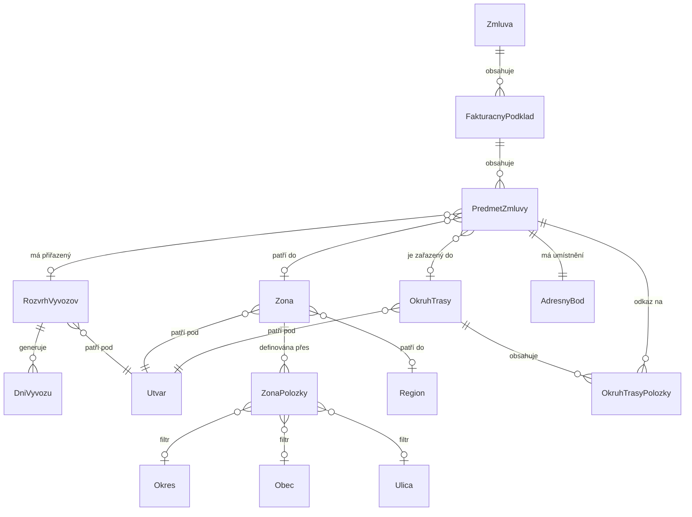
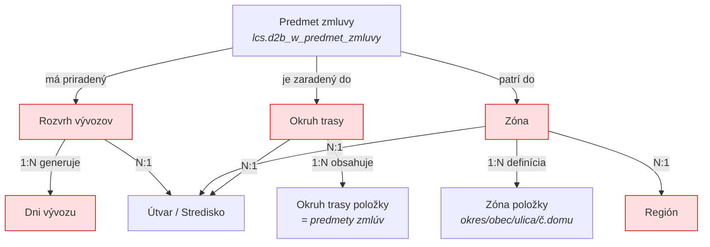

# Analýza nových entit HeN pro cyklické svozy

> Zdroj: `data/input/helios_new_entities/StudiaRealizovatelnosti.docx` + `data/input/helios_new_entities/Obec Košariská.xlsx`
> Datum analýzy: 2026-03-31

## 1. Kontext a východiskový stav

### Stávající datový model (MDB → RP)

> Zdroj: StudiaRealizovatelnosti.docx, sekce "Východiskový stav → Dátový model a kľúče", odst. 7–18

Stávající přenos dat z HeN do MDB/RP pokrývá tyto entity:


| MDB entita           | HeN protějšek            | Klíč                    | Poznámka                                                                                                    |
| ---------------------- | ---------------------------- | --------------------------- | -------------------------------------------------------------------------------------------------------------- |
| **Customer**         | Organizácia + Expozitúra | Key4 (modifikovaný)      | Spájanie dvou HeN entit do jedné                                                                           |
| **CustomerContract** | Zmluva                     | Key1 (generovaný vzorec) | Na MDB vznikají zmluvy, které v HeN nejsou (kombinace zmluva + fakturačný podklad + koncový zákazník) |
| **CustomerItem**     | Predmet zmluvy             | **Bez PK z HeN**          | Generuje se osobitný kľúč (Sequence). Nepřenáší se primární klíč z HeN                           |
| **Address**          | Adresný bod               | Key2 (modifikovaný)      | Spájanie nestrukturalizovanej adresy Organizácií a Expozitúr s adresnými bodmi                          |
| **CustomerSite**     | *(neexistuje v HeN)*       | Key3 (generovaný)        | HeN neeviduje stanoviská — MDB je generuje z kombinácie koncový zákazník + adresa                      |

### Klíčový předpoklad pro nové entity

> Zdroj: StudiaRealizovatelnosti.docx, sekce "Realizovateľnosť → Predpoklad", odst. 98–99

> Rozšíření CustomerItem na MDB a RP o **primární klíč predmetu z HeN** (`číslo nonsubjektu triedy lcs.d2b_w_predmet_zmluvy`) → jednoznačné priame prepojenie na úrovni predmetov medzi RP a HeN.

## 2. Nové entity — datový model

### ER diagram (HeN nové objekty)

> Zdroj: StudiaRealizovatelnosti.docx, obrázek 2 (image2.png) — "Dátový model objektov v HeN"



---

### 2.1 Kalendár (Rozvrh vývozov)

> Zdroj: StudiaRealizovatelnosti.docx, sekce "Popis objektov potrebných pre riadenie cyklických zvozov → Kalendár", odst. 20–33

Kalendár je tvorený triedou pre jeho definíciu a potom triedou s konkrétnymi dňami (dátum) zvozu vygenerovaným na základe definície.

#### Trieda :: Rozvrh vývozov (hlavička)


| Atribút           | Typ                    | Popis                                                                       |
| :------------------- | ------------------------ | ----------------------------------------------------------------------------- |
| Referencia         | ID (7-miestne číslo) | PK, generované vzostupne                                                   |
| Názov             | text                   | Názov kalendára vyskladaný automaticky z roku/týždňa/dní/počet dní |
| Frekvencia         | kombobox               | Typ rozvrhu:**denne** / **týždenne** / **vlastné**                       |
| Den svozu - kód   |                        |                                                                             |
| Den svozu - název |                        |                                                                             |
|                    |                        |                                                                             |

**Typy frekvencie:**

- **Denne** — štartovací dátum + počet opakovaní, ktorý ďalší deň v poradí sa má opakovať
- **Týždenne** — zvolené dni vývozov v týždni + typ týždňa (párny/nepárny)
- **Vlastné** — do jednotlivých mesiacov vložiť počet dní zvozov; po vygenerovaní pole „rozdiel v dňoch vývozov" koľko dní je potrebné označiť funkciou

**Funkcia:** *Vytvoriť dni rozvrhu* — vygeneruje záznamy do triedy Dni vývozu a vytvorí väzbu na Rozvrh vývozov

---

### 2.2 Dni vývozu (svozu)

> Zdroj: StudiaRealizovatelnosti.docx, sekce "Kalendár → Trieda :: Dni vývozu", odst. 34–42
> Zdroj: Obec Košariská.xlsx, sheet "Rozvth" (stĺpce A–L)

Konkrétní kalendářní dny, kdy se má svoz uskutečnit. Generovány z Kalendáře. Formulár je needitovateľný, zmena stavu len cez funkciu.

#### Trieda :: Dni vývozu


| Atribút        | Typ                   | Popis                                       |
| ----------------- | ----------------------- | --------------------------------------------- |
| Rozvrh vývozov | SV → Rozvrh vývozov | Statický vzťah na rozvrh                  |
| Vývoz          | ÁNO/NIE              | Prepínanie cez funkciu „Prepnúť vývoz" |
| Deň            | dátum                | Dátum dňa vývozu                         |

#### Příklad z dat

> Zdroj: Obec Košariská.xlsx, sheet "Rozvth" — rozvrh pre obec Košariská

Rozvrh `26|DEN/KAŽDÝ 21./2.1.2.1.1.2.1.2.1.2.1.2/18` — 18 svozových dní v roce 2026, frekvence cca každý 21. den:


| Vývoz | Deň            | Týždeň | Typ týždňa |
| -------- | ----------------- | ----------- | --------------- |
| Áno   | 2026-01-05 (Po) | 2         | Párny        |
| Áno   | 2026-01-27 (Ut) | 5         | Nepárny      |
| Áno   | 2026-02-17 (Ut) | 8         | Párny        |
| ...    | ...             | ...       | ...           |
| Áno   | 2026-12-29 (Ut) | 53        | Nepárny      |

**Ďalšie atribúty viditeľné v xlsx dátach:**


| Atribút            | Typ      | Popis                           |
| --------------------- | ---------- | --------------------------------- |
| Deň v týždni     | text     | Pondelok, Utorok, ...           |
| Týždeň v mesiaci | číslo  | Poradie týždňa v mesiaci     |
| Štvrťrok          | číslo  | Číslo štvrťroku             |
| Týždeň           | číslo  | Číslo týždňa v roku        |
| Typ týždňa       | text     | Párny / Nepárny               |
| Víkend             | ÁNO/NIE | Či je deň cez víkend         |
| Sviatok             | ÁNO/NIE | Či je deň sviatok             |
| Posledný v mesiaci | ÁNO/NIE | Či je posledný deň v mesiaci |
| Poznámka           | text     | Voliteľná poznámka           |

**Funkcia:** *Prepnúť vývoz* — prepne stav v poli Vývoz na ÁNO/NIE

---

### 2.3 Zóna

> Zdroj: StudiaRealizovatelnosti.docx, sekce "Zóna", odst. 43–66

Zóna je položková trieda, ktorá má na hlavičke údaje na identifikáciu zóny a na položkách údaje buď na konkrétny adresný bod alebo sadu adresných bodov definovanú cez okres, obec, časť obce, ulicu a číslo domu.

#### Trieda :: Zóna (hlavička)


| Atribút        | Typ             | Popis                                                    |
| ----------------- | ----------------- | ---------------------------------------------------------- |
| Referencia      | ID (7-miestne)  | Generuje sa podľa prednastavenej masky (od 1 nahor)     |
| Názov subjektu | text            | Užívateľský názov zóny                             |
| Typ             | číslo         | Užívateľské číselné pole pre typ zóny            |
| Aktívne        | ÁNO/NIE        | Stanovuje či zóna sa používa a ponúka vo výberoch  |
| Stav            | kombo           | Aktívne / Neaktívne                                    |
| Poznámka       | text            | Užívateľská poznámka — popis zóny                 |
| Región         | SV → Región   | Statický vzťah na textový užívateľský číselník |
| DV Útvar       | DV → Stredisko | Strediská pre ktoré sa zóna používa                 |

**Tlačítko:** *Adresy zóny* — zobrazí zoznam adresných bodov ktoré sú v zóne zahrnuté

**Dôležité:** Zóna neobsahuje konkrétne adresné body ale len **definíciu na rôznom stupni úrovne** Okres/Obec/Časť obce/Ulica/Číslo od/Číslo do (potvrdené v sekcii Realizovateľnosť, odst. 100).

#### Zóna — položky


| Atribút        | Typ                         | Popis                                                                             |
| ----------------- | ----------------------------- | ----------------------------------------------------------------------------------- |
| Riadok          | číslo                     | Číslo riadku                                                                    |
| Okres           | SV → Okres                 | Ak vyplnený len okres → do zóny zahrnuté všetky adresné body daného okresu |
| Obec            | SV → Obec                  | Zúži výber na obec                                                             |
| Časť obce     | select (z adresných bodov) | Zúži výber na časť obce                                                      |
| Mestská časť | select (z adresných bodov) | Zúži výber na mestskú časť                                                  |
| Ulica           | SV → Ulica                 | Predfiltrované vyššími úrovňami. Možno vybrať viacero naraz               |
| Číslo domu od | číslo                     | Číslo domu od (ak zhodné s "do" → konkrétny adresný bod)                    |
| Číslo domu do | číslo                     | Číslo domu do                                                                   |

**Logika filtrovania** (hierarchická — každá úroveň zužuje výber):

```
Okres → Obec → Časť obce → Mestská časť → Ulica → Číslo domu od/do
```

---

### 2.4 Okruh (Okruh trasy)

> Zdroj: StudiaRealizovatelnosti.docx, sekce "Okruh", odst. 68–90
> Zdroj: Obec Košariská.xlsx, sheet "Okruh trasy - číselník" (93 záznamov), sheet "Okruh trasy - Košariská1" (278 položiek)

Logické zoskupenie predmetov zmlúv pre **plánovanie trasy zvozu**.

#### Trieda :: Okruh trasy (hlavička)


| Atribút               | Typ                   | Popis                                                                                   |
| ------------------------ | ----------------------- | ----------------------------------------------------------------------------------------- |
| Referencia             | text                  | Negeneruje sa (nie je stanovená maska), zadáva užívateľ                            |
| Názov subjektu        | text                  | Užívateľský názov okruhu                                                           |
| Aktívne               | ÁNO/NIE              | Stanovuje či okruh sa používa a ponúka vo výberoch                                 |
| Poznámka              | text                  | Užívateľská poznámka — popis okruhu                                               |
| Dni zvozu              | zobrazenie (computed) | Zobrazuje v ktoré dni sú zvážané predmety zaradené do okruhu                      |
| Typ týždňa          | zobrazenie (computed) | Zobrazuje aký týždeň (párne/nepárne)                                              |
| Celkový počet nádob | zobrazenie (computed) | Sumárny počet nádob z predmetov zaradených do okruhu                                |
| Celkový objem nádob  | zobrazenie (computed) | Sumárny objem nádob z predmetov zaradených do okruhu                                 |
| DV Útvar              | DV → Stredisko       | Stredisko pre ktoré je okruh platný a pre ktoré zobrazuje predmety zmlúv do výberu |

**Tlačítko:** *Pridať predmety* — pridá predmety zmlúv do okruhu

#### Okruh trasy — položky

Formulár je **needitovateľný**, položky vznikajú funkciou „Pridať predmety".


| Atribút       | Typ                  | Popis                                                  |
| ---------------- | ---------------------- | -------------------------------------------------------- |
| R              | číslo              | Číslo riadku                                         |
| Predmet zmluvy | SV → Predmet zmluvy | Statický vzťah na predmet zmluvy zaradený do okruhu |
| Počet nádob  | číslo              | Počet nádob na predmete                              |
| Typ nádoby    | text                 | Typ nádoby naviazanej na predmete                     |
| Objem nádoby  | číslo              | Objem nádoby na predmete                              |
| Odpad          | text                 | Katalógové číslo odpadu naviazaného na predmete   |
| Názov odpadu  | text                 | Názov odpadu naviazaného na predmete                 |

#### Príklad z dát

> Zdroj: Obec Košariská.xlsx, sheet "Okruh trasy - číselník" (výber)


| Referencia | Názov                                 | Dni zvozu         | Typ týždňa             | Stredisko |
| ------------ | ---------------------------------------- | ------------------- | --------------------------- | ----------- |
| 0000001    | KO - Nimnica, Visolaje                 | Žiadne dni zvozu | —                        | 4010      |
| 0000002    | KO - Bodiná...Počarová              | Utorok            | Nepárny týždeň        | 4010      |
| 0000004    | KO - H. Maríková, Hatné, Klieština | Pondelok          | Párny+Nepárny týždeň | 4010      |

> Zdroj: Obec Košariská.xlsx, sheet "Okruh trasy - Košariská1"

Okruh `KOS_Košariská` má 278 predmetov zmluvy (nádob), všetky komunálny odpad 200301, typy nádob 110l/120l/240l/1100l.

---

### 2.5 Región (číselník)

> Zdroj: StudiaRealizovatelnosti.docx, sekce "Zóna", odst. 45, 56 — zmienený ako SV na hlavičke Zóny

Jednoduchý textový užívateľský číselník:


| Atribút   | Typ  | Popis           |
| ------------ | ------ | ----------------- |
| Referencia | text | Identifikátor  |
| Názov     | text | Názov regiónu |

Slúži ako kategorizácia zón. Na hlavičke Zóny je pre osobitnú identifikáciu vzťah na tento číselník.

---

## 3. Vzťahy medzi entitami (súhrn)

> Zdroj: StudiaRealizovatelnosti.docx, obrázok 2 (image2.png) + textové popisy entít



*Červeně = nové entity (scope integračních služieb)*

---

## 4. Navrhované integračné služby

> Zdroj: StudiaRealizovatelnosti.docx, sekce "Realizovateľnosť → Záver", odst. 106–119

Rozšírenie rozhrania nepôjde ďalším rozširovaním MDB. Pripraví sa sada služieb.

### Datasety — RP volá služby HeN (čítanie)

RP si vyžiada dáta z HeN volaním jeho služieb.


| Služba    | Popis                                         |
| ------------ | ----------------------------------------------- |
| Kalendáre | Zoznam rozvrhov vývozov                      |
| Dni zvozov | Dni zvozov pre daný kalendár                |
| Zóna      | Definície zón vč. položiek                |
| Okruh      | Definície okruhov vč. položiek (predmetov) |
| Región    | Číselník regiónov                         |

### Procesy — HeN volá služby RP (zápis / notifikácia o zmenách)

Keď užívateľ vykoná zmenu v HeN, HeN zavolá službu RP a aktívne mu pošle informáciu o zmene.


| Služba                                            | Popis                                                 |
| ---------------------------------------------------- | ------------------------------------------------------- |
| Vytvorenie/Zmazanie kalendára                     | Nový kalendár vznikol alebo bol zmazaný v HeN      |
| Zmena dňa zvozu na kalendári                     | Prepnutie vývozu ÁNO/NIE na konkrétnom dni         |
| Priradenie/Odviazanie kalendára k predmetu zmluvy | Kalendár bol priradený alebo odviazaný od predmetu |
| Zmena na definícii Zóny                          | Zmena regiónu alebo rozsahu adresných bodov         |
| Vytvorenie/Zmazanie okruhu                         | Nový okruh vznikol alebo bol zmazaný v HeN          |
| Priradenie/Odviazanie predmetu z okruhu            | Predmet zmluvy bol pridaný alebo odobraný z okruhu  |

---

## 5. Kľúčové pozorovania

1. **Eliminácia MDB**: Štúdia explicitne hovorí, že rozšírenie rozhrania **nepôjde ďalším rozširovaním MDB** — miesto toho sada služieb (API).

   > Zdroj: StudiaRealizovatelnosti.docx, odst. 106
   >
2. **PK predmetu zmluvy**: Kritický predpoklad — rozšírenie CustomerItem o `číslo nonsubjektu` z HeN (`lcs.d2b_w_predmet_zmluvy`) ako jednoznačný kľúč pre všetku komunikáciu.

   > Zdroj: StudiaRealizovatelnosti.docx, odst. 98–99
   >
3. **Predmet zmluvy ako centrálny bod**: Všetky tri nové entity (Kalendár, Zóna, Okruh) sa viažu na predmet zmluvy. Predmet je jadro dátového modelu CS.

   > Zdroj: StudiaRealizovatelnosti.docx, obrázok 2
   >
4. **Zóna = definícia, nie výčet**: Zóna neobsahuje zoznam konkrétnych adresných bodov, ale hierarchickú definíciu (okres→obec→ulica→č.domu). Adresné body sa dopočítajú.

   > Zdroj: StudiaRealizovatelnosti.docx, odst. 100
   >
5. **Okruh = logické zoskupenie pre plánovanie trás**: Okruh združuje predmety zmlúv, agreguje štatistiky (počet/objem nádob). Computed polia Dni zvozu a Typ týždňa sa odvodzujú z predmetov.

   > Zdroj: StudiaRealizovatelnosti.docx, odst. 77–80
   >
6. **Smer integrácie**: Datasety = RP volá služby HeN (čítanie). Procesy = HeN volá služby RP (notifikácia o zmenách vykonaných v HeN).

   > Zdroj: StudiaRealizovatelnosti.docx, odst. 107, 113
   >
