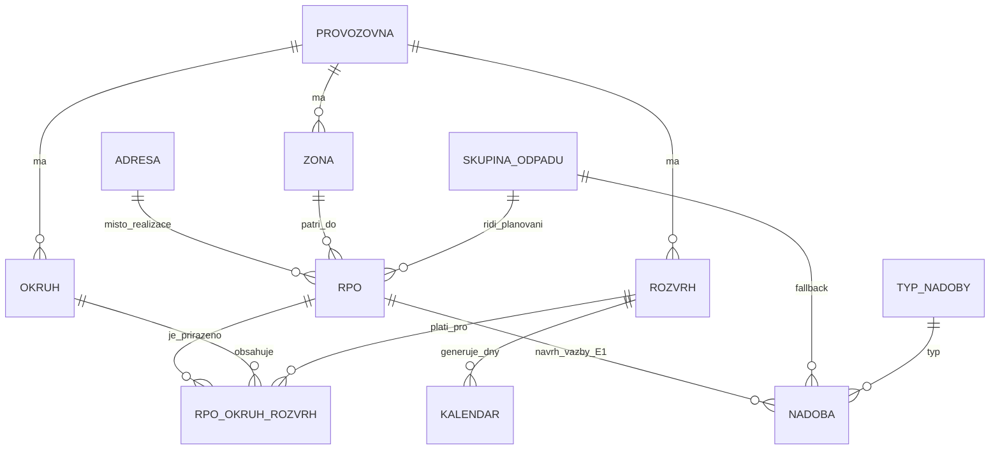
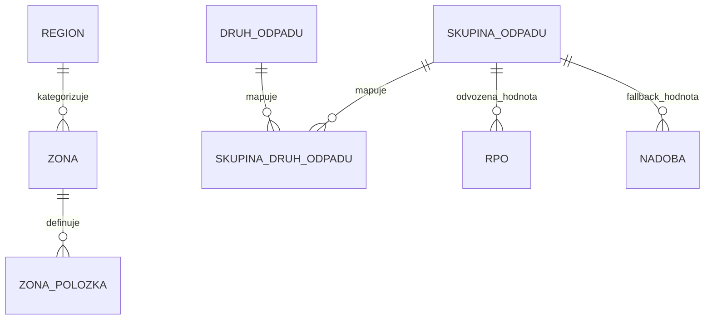

# Datový model PP — Rozšíření pro CS (v2)

- Page ID: 123372122
- Source URL: https://confluence.radium.cz/pages/viewpage.action?pageId=123372122
- Navazuje na: [Datový slovník PP](https://confluence.radium.cz/pages/viewpage.action?pageId=88033012)
- Verze: v2
- Zpracováno: 2026-04-07

---

**Účel:** Doplňkový dokument k [Datovému slovníku PP](https://confluence.radium.cz/pages/viewpage.action?pageId=88033012) popisující rozšíření datového modelu PP pro Cyklické svozy (CS, Etapa 1). Nové entity jsou plně dokumentovány v notaci datového slovníku. Existující entity jsou dokumentovány pouze formou **delta** — nových nebo změněných atributů. Fyzický DDL a SoT specifikace jsou součástí [v1 tohoto dokumentu](datovy-model-navrh-reseni-123372122.md).

**Vstupní podklady:**

- [datovy-model-navrh-reseni-123372122.md](../PP-datovy-model-navrh-reseni-v1/datovy-model-navrh-reseni-123372122.md) — návrh datového modelu v1 (zdroj entit, atributů a AR)
- [gap-analyza-navrhu-reseni.md](../PP-datovy-model-navrh-reseni-v1/gap-analyza-navrhu-reseni.md) — 11 identifikovaných mezer
- [hen-nove-entity-analyza.md](../PP-datovy-model-navrh-reseni-v1/hen-nove-entity-analyza.md) — analýza nových entit HEN
- UC 202ucxx — Synchronizace dat z Helios MPG SK — stávající synchronizační UC; referenční rámec pro zachování stávajícího integračního mechanismu (dostupný v `300_Pasport-Aktualni-dokumentace/UC-Pasport/202ucxx-synchronizace-dat-z-helios-mpg-sk/`)
- UC 200ucxx — Obecná synchronizační komponenta — rámcová architektura UC pro synchronizaci přes `external_id`; upsert model (dostupný v `300_Pasport-Aktualni-dokumentace/UC-Pasport/200ucxx-obecna-synchronizacni-komponenta/`)

---

# Přehled

## Architektonická rozhodnutí

| ID | Oblast | Rozhodnutí | Dotčené entity |
|---|---|---|---|
| **AR-01** | Vazební model Okruh/Rozvrh ↔ RPO | PP konsoliduje dvě HEN struktury (přiřazení okruhu a rozvrhu k predmetu) do jedné temporální tabulky `RPO_Okruh_Rozvrh` s platností od/do. Mapování z HEN zajistí integrační vrstva. | RPO, Okruh, Rozvrh, RPO_Okruh_Rozvrh |
| **AR-02** | Model Zóny — geometrie vs. adresní definice | Atribut `geometrie` odebrán z business DS Zóny. Adresní definice zóny (Okres → Obec → Ulica → č. domu) se přenáší přes novou entitu `Zóna položky`. Geometrie zůstává jako technická/odvozená hodnota pro vizualizaci. | Zóna, Zóna položky, Région |
| **AR-03** | Rozvrh — parametry frekvence | Parametry frekvence (DENNI / TYDENNI / VLASTNI) modelovány jako nullable atributy přímo na entitě `Rozvrh` — denormalizovaný přístup pro jednoduchost E1. | Rozvrh |
| **AR-04** | Rozšíření stávající RPO synchronizace (202ucxx) | Stávající MDB synchronizační mechanismus pro RPO zůstává zachován včetně stávajícího složeného `external_id` dle 202ucxx / 202uc10. Integrační DB bude rozšířena o samostatný jednoznačný identifikátor RPO z HEN (`číslo nonsubjektu třídy lcs.d2b_w_predmet_zmluvy`), který se přenese do PP jako doplňkový technický atribut. Žádná změna stávajícího integračního kontraktu 202ucxx. | RPO |
| **AR-05** | Synchronizace nových entit CS — příjem změnových dat | Nové entity CS (Okruh, Rozvrh, Kalendar, Zóna, Zóna položky, Région) nejsou součástí stávajícího MDB kontraktu 202ucxx. Do PP budou plněny příjmem změnových dat z HEN, typicky přes REST API nebo samostatný import při inicializaci. Detailní integrační mechanismus není předmětem tohoto dokumentu. | Okruh, Rozvrh, Kalendar, Zóna, Zóna položky, Région |
| **AR-06** | Editační režim synchronizovaných entit CS | V Etapě 1 PP nové synchronizované entity a jejich vazby pouze eviduje a zobrazuje. Editace v aplikaci není povolena. Platí to i pro vazbu `RPO_Okruh_Rozvrh`. | Okruh, Rozvrh, Kalendar, Zóna, Zóna položky, Région, RPO_Okruh_Rozvrh |

## Strategie `external_id`

Každá synchronizovaná entita nese atribut `Externí identifikátor` jako **technický integrační klíč** — odlišný od business identifikátoru (`Reference`, `Kód položky`) zobrazovaného uživatelům. Externí identifikátor je v rámci tabulky jedinečný. U RPO zůstává zachován stávající složený `external_id` dle 202ucxx; jednoznačný identifikátor RPO z HEN je veden samostatně.

| Entita | Zdroj identifikátoru | Poznámka |
|---|---|---|
| RPO | Složený `external_id` z MDB dle 202ucxx (`<Id>::<CustomerSiteId>::<ContractSubjectTypeId>::<Sequence>`) | Stávající integrační kontrakt je zachován; integrační DB bude rozšířena o samostatný HEN identifikátor RPO (`číslo nonsubjektu třídy lcs.d2b_w_predmet_zmluvy`). |
| Okruh | Číslo nonsubjektu Okruh trasy | |
| Rozvrh | Referencia rozvrhu vývozov | |
| Kalendar | ID záznamu Dni vývozu | |
| Zóna | Číslo nonsubjektu Zóna | |
| Région | Referencia regionu | |

## Přehled entit

| # | Entita | DDL tabulka | Stav v rámci CS | Sekce |
|---|---|---|---|---|
| 1 | RPO | `order_item_revision` | Existující — rozšíření | [Rozšíření existujících entit → RPO](#rpo) |
| 2 | Okruh | `okruh` | Nová | [Okruhy a rozvrhy → Okruh](#okruh) |
| 3 | Rozvrh | `rozvrh` | Nová | [Okruhy a rozvrhy → Rozvrh](#rozvrh) |
| 4 | Kalendar (Den vývozu) | `kalendar` | Nová | [Okruhy a rozvrhy → Kalendar](#kalendar-den-vývozu) |
| 5 | Zóna | `zone` | Nová | [Zóny → Zóna](#zóna) |
| 6 | Adresy | `address` | Existující — rozšíření | [Rozšíření existujících entit → Adresy](#adresy) |
| 7 | Skupina odpadu | `garbage_group` | Existující — rozšíření | [Rozšíření existujících entit → Skupina odpadu](#skupina-odpadu) |
| 8 | Druh odpadu | `garbage_type` | Existující — rozšíření (bez fyzického delta DDL) | [Rozšíření existujících entit → Druh odpadu](#druh-odpadu) |
| 9 | Nádoba | `container` | Existující — rozšíření | [Rozšíření existujících entit → Nádoba](#nádoba) |
| 10 | Stanoviště | `site` | Existující — beze změn | — |
| 11 | Typ nádoby | `container_type` | Existující — rozšíření | [Rozšíření existujících entit → Typ nádoby](#typ-nádoby) |
| 12 | RPO_Okruh_Rozvrh | `rpo_okruh_rozvrh` | Nová | [Nová přiřazení → RPO_Okruh_Rozvrh](#rpo_okruh_rozvrh) |
| 13 | Nadoba_Stanoviste | `site_container_assignment` | Existující vazební — beze změn | — |
| 14 | Skupina_Druh_odpadu | `skupina_druh_odpadu` | Nová | [Nová přiřazení → Skupina_Druh_odpadu](#skupina_druh_odpadu) |
| 15 | Zóna položky | `zona_polozka` | Nová | [Zóny → Zóna položky](#zóna-položky) |
| 16 | Région | `region` | Nová | [Zóny → Région](#région) |

---

# Grafický přehled datového modelu

Tato sekce slouží jako **pracovní vizuální mapa** návrhu řešení datového modelu pro CS. Diagramy jsou záměrně zjednodušené, aby bylo možné model postupně projít a kontrolovat. Detail atributů, technických omezení a integračních pravidel je popsán v následujících sekcích dokumentu.

## 1. Jádro modelu CS

Poznámky k diagramu:
- `RPO_Okruh_Rozvrh` je temporální vazební entita konsolidující přiřazení Okruh + Rozvrh k RPO.
- Vazba `RPO → Nádoba` je v návrhu zakreslena pro orientaci, ale její cílový model zůstává otevřený v OB-04.
- `Provozovna` je společný organizační kontext pro Okruh, Rozvrh a Zónu; přesné mapování na HEN `Útvar/Stredisko` zůstává otevřené v OB-02.

## 2. Zóny a odpadové mapování

Poznámky k diagramu:
- `Zóna` a `Zóna položky` jsou synchronizované z HEN; PP je v E1 pouze eviduje a zobrazuje.
- `Skupina odpadu` se **nesynchronizuje z HEN**; v PP se určuje na základě `Druhu odpadu` a aplikačních pravidel.
- `Skupina_Druh_odpadu` představuje temporální mapování pro odvození plánovací skupiny odpadu v čase.

---

# Synchronizační rámec

Tato sekce definuje základní strategii synchronizace dat mezi HEN (Helios Nephrite) a PP (Pasport) v kontextu CS. Klíčový princip: **stávající entity pokračují stávajícím mechanismem** dle UC 202ucxx; **nové entity CS** jsou plněny příjmem změnových dat z HEN nebo samostatným importem a v PP jsou pouze evidovány a zobrazovány (viz AR-05, AR-06).

**Referenční dokumenty:**
- UC 202ucxx — stávající synchronizační UC pro Helios MPG SK (MDB → sync služba → API PP)
- UC 200ucxx — obecná synchronizační komponenta (rámec pro upsert přes `external_id`)

## Matice synchronizace entit CS

| Entita | Zdroj pravdy (SoT) | Mechanismus | Směr | UC reference |
|---|---|---|---|---|
| Zákazník | HEN | Stávající — MDB → sync služba → API PP | HEN → PP | 202ucxx |
| Objednávka | HEN | Stávající — MDB → sync služba → API PP | HEN → PP | 202ucxx |
| RPO | HEN | Stávající — MDB → sync služba → API PP; složený `external_id` dle 202ucxx zůstává zachován, integrační DB je rozšířena o HEN identifikátor RPO (AR-04) | HEN → PP | 202uc10 |
| Základní dny svozu | HEN | Stávající — MDB → sync služba → API PP | HEN → PP | 202ucxx |
| Typ nádoby | HEN | Stávající — MDB → sync služba → API PP | HEN → PP | 202ucxx |
| Druh odpadu | HEN | Stávající — MDB → sync služba → API PP | HEN → PP | 202ucxx |
| Skupina odpadu | PP | Odvození v PP z Druhu odpadu v navazujícím kroku synchronizace RPO / Položky objednávky z MDB | interní | 202uc10 + aplikační pravidlo PP |
| Adresa | HEN | Stávající — MDB → sync služba → API PP | HEN → PP | 202ucxx |
| **Okruh** | HEN | **Příjem změnových dat z HEN** / samostatný import (AR-05) | HEN → PP | Nový UC (viz OB-07) |
| **Rozvrh** | HEN | **Příjem změnových dat z HEN** / samostatný import (AR-05) | HEN → PP | Nový UC (viz OB-07) |
| **Kalendar** | HEN | **Příjem změnových dat z HEN** / samostatný import (AR-05) | HEN → PP | Nový UC (viz OB-07) |
| **Zóna** | HEN | **Příjem změnových dat z HEN** / samostatný import (AR-05) | HEN → PP | Nový UC (viz OB-07) |
| **Zóna položky** | HEN | **Příjem změnových dat z HEN** / samostatný import (AR-05) | HEN → PP | Nový UC (viz OB-07) |
| **Région** | HEN | **Příjem změnových dat z HEN** / samostatný import (AR-05) | HEN → PP | Nový UC (viz OB-07) |
| Vozidlo na Okruhu | PP | V E1 se neplní; vazba v HEN neexistuje a editace synchronizovaných entit není povolena | — | — |

## Pravidla synchronizačního rámce

1. **Stávající MDB mechanismus se nemění.** Entity dosud synchronizované přes MDB (202ucxx) pokračují beze změny. U RPO zůstává zachován stávající složený `external_id`; integrační DB se pouze rozšiřuje o samostatný HEN identifikátor RPO (AR-04).
2. **Nové entity CS se plní příjmem změnových dat z HEN.** Okruh, Rozvrh, Kalendar, Zóna, Zóna položky a Région nejsou součástí stávajícího MDB kontraktu 202ucxx. Do PP se plní příjmem změnových dat z HEN nebo samostatným importem při inicializaci (AR-05).
3. **Nové synchronizované entity a jejich vazby jsou v PP needitovatelné.** PP je v E1 pouze eviduje a zobrazuje; editace v aplikaci není povolena (AR-06).
4. **Konsolidace `RPO_Okruh_Rozvrh` probíhá v PP.** HEN poskytuje Okruh a Rozvrh jako samostatné informace; PP je při zpracování změnových dat konsoliduje do temporální tabulky `RPO_Okruh_Rozvrh` (AR-01).
5. **Skupina odpadu není synchronizována z HEN.** HEN neobsahuje entitu Skupina odpadu. Skupina odpadu se určuje až v PP v navazujícím kroku synchronizace RPO / Položky objednávky z MDB, a to na základě Druhu odpadu a aplikačních pravidel PP.
6. **Detailní integrační mechanismus není předmětem tohoto dokumentu.** Tento návrh řešení definuje pouze základní synchronizační rámec; detailní datové kontrakty, způsob předávání změn a inicializační bulk-load řeší samostatný integrační úkol.

---

# Rozšíření existujících entit

Tato sekce dokumentuje **pouze nové nebo změněné atributy** (delta) existujících entit. Kompletní atributová dokumentace je v [Datovém slovníku PP](https://confluence.radium.cz/pages/viewpage.action?pageId=88033012).

## RPO

Centrální entita CS — Revize položky objednávky. Základ pro plánování, filtraci a vazby na provozní objekty Cyklických svozů. Kompletní dokumentace: [Datový slovník → Objednávky → Revize položky objednávky](https://confluence.radium.cz/pages/viewpage.action?pageId=88033012).

*Interní poznámka: DDL tabulka `order_item_revision`.*

Níže jsou dokumentovány pouze **nové atributy přidané pro CS**:

| Atribut | Datový typ | Rozsah | Asociace | Povinnost | Popis | Persistentní reference | Poznámka |
|---|---|---|---|---|---|---|---|
| Externí identifikátor | Řetězec | 50 | – | Ano | Technický integrační klíč dle stávajícího kontraktu 202ucxx. Formát: `<Id>::<CustomerSiteId>::<ContractSubjectTypeId>::<Sequence>`. Slouží výhradně pro integraci — odlišný od business Kódu položky i od jednoznačného identifikátoru RPO z HEN. | – | **Externí identifikátor je v rámci tabulky jedinečný a zůstává zachován kvůli kompatibilitě s 202ucxx.** |
| HEN identifikátor RPO | Řetězec | 50 | – | Ano | Jednoznačný identifikátor RPO z HEN (`číslo nonsubjektu třídy lcs.d2b_w_predmet_zmluvy`). Slouží pro přímé napojení nových entit CS na RPO a pro interní integrační vazby. | – | Integrační DB bude rozšířena o tuto hodnotu; **nenahrazuje** stávající `Externí identifikátor`. |
| Kód položky | Řetězec | 100 | – | Ano | Business identifikátor RPO pocházející z HEN; zobrazovaný uživatelům. Koexistuje s externím identifikátorem — každý plní jinou roli. | – | – |
| Skupina odpadu | Reference | – | Skupina odpadu | Ne | Plánovací skupina odpadu přiřazená k RPO. Řídicí hodnota pro skupinu odpadu navázané nádoby (viz pravidla priority v části Nádoba). | Ano | Hodnota se **nepřenáší z HEN**; určuje se v PP v navazujícím kroku synchronizace RPO / Položky objednávky z MDB na základě Druhu odpadu. |
| Zóna | Reference | – | Zóna | Ne | Geografická zóna, do níž RPO spadá. Plánovací a filtrační kontext. | Ano | Kardinalita N:1 — více RPO může být ve stejné zóně. CS rozšíření. |

## Adresy

Evidence adres používaná mj. pro místo realizace na RPO. Kompletní dokumentace: [Datový slovník → Obecné → Adresa](https://confluence.radium.cz/pages/viewpage.action?pageId=88033012).

*Interní poznámka: DDL tabulka `address`.*

Níže jsou dokumentovány pouze **nové atributy přidané pro CS**:

| Atribut | Datový typ | Rozsah | Asociace | Povinnost | Popis | Persistentní reference | Poznámka |
|---|---|---|---|---|---|---|---|
| Souřadnice X | Desetinné číslo | – | – | Ne | Zeměpisná délka (X) geokódovaného místa realizace. Primárně se pro lokalizaci RPO používá stanoviště; tato souřadnice je fallback. | – | – |
| Souřadnice Y | Desetinné číslo | – | – | Ne | Zeměpisná šířka (Y) geokódovaného místa realizace. Primárně se pro lokalizaci RPO používá stanoviště; tato souřadnice je fallback. | – | – |

## Skupina odpadu

Seskupení druhů odpadu pro plánování a výběr RPO. CS zavádí evidenci per provozovna. Kompletní dokumentace: [Datový slovník → Obecné → Skupina odpadu](https://confluence.radium.cz/pages/viewpage.action?pageId=88033012).

*Interní poznámka: DDL tabulka `garbage_group`.*

Níže jsou dokumentovány pouze **nové atributy přidané pro CS**:

| Atribut | Datový typ | Rozsah | Asociace | Povinnost | Popis | Persistentní reference | Poznámka |
|---|---|---|---|---|---|---|---|
| Provozovna | Reference | – | Provozovna | Podmíněná — dle migrace | Provozovna, k níž skupina odpadu patří. CS zavádí evidenci skupin per provozovna. | Ano | Migrační strategie (přiřazení existujících skupin k provozovnám) se potvrzuje v OB-05. |
| Je MIX | Boolean | – | – | Ano | Příznak kombinovaného svozu. Hodnota se určuje aplikačním pravidlem v PP; HEN skupinu odpadu neobsahuje. | – | Speciální skupina MIX: určuje se v rámci odvození skupiny odpadu z Druhu odpadu. Pravidlo RP: 1 okruh dne = 1 skupina odpadu. |

## Druh odpadu

Číselník druhů odpadu. Kompletní dokumentace: [Datový slovník → Obecné → Druh odpadu](https://confluence.radium.cz/pages/viewpage.action?pageId=88033012).

*Interní poznámka: DDL tabulka `garbage_type`.*

CS nerozšiřuje Druh odpadu o nové fyzické atributy. Rozšíření spočívá v zavedení vazební entity [Skupina_Druh_odpadu](#skupina_druh_odpadu) pro temporální mapování Druh odpadu ↔ Skupina odpadu.

## Nádoba

Fyzická odpadová nádoba. Kompletní dokumentace: [Datový slovník → Nádoby → Nádoba](https://confluence.radium.cz/pages/viewpage.action?pageId=88033012).

*Interní poznámka: DDL tabulka `container`.*

Níže jsou dokumentovány pouze **nové atributy přidané pro CS**:

| Atribut | Datový typ | Rozsah | Asociace | Povinnost | Popis | Persistentní reference | Poznámka |
|---|---|---|---|---|---|---|---|
| RPO | Reference | – | RPO | Ne | Revize položky objednávky, na niž je nádoba navázána. Váže obchodní kontext (okruh, rozvrh, zóna) k fyzické nádobě. | Ano | Kolize s inventářem PP — v inventáři je vazba vedena přes `container_order_item_assignment`, v návrhu CS přes přímý FK. Viz OB-04. |
| Skupina odpadu | Reference | – | Skupina odpadu | Ne | Fallback skupina odpadu — platí pouze pokud nádoba není navázána na RPO nebo navázané RPO skupinu odpadu nemá. | Ano | **Řídicí hodnota je vždy z navázaného RPO** (pokud existuje a má skupinu odpadu vyplněnu). Přímé zadání povoleno pouze bez RPO nebo při prázdné skupině na RPO. |
| RFID | Řetězec | 100 | – | Ne | Identifikátor RFID čipu pro automatizovanou identifikaci nádoby při výsypu. | – | **RFID je v rámci tabulky jedinečný.** |
| Objem (litry) | Desetinné číslo | – | – | Ne | Fyzický objem nádoby v litrech. | – | – |

## Typ nádoby

Číselník typů nádob; zdroj parametrů pro plánování. Kompletní dokumentace: [Datový slovník → Objednávky → Typ nádoby](https://confluence.radium.cz/pages/viewpage.action?pageId=88033012).

*Interní poznámka: DDL tabulka `container_type`.*

Níže jsou dokumentovány pouze **nové atributy přidané pro CS**:

| Atribut | Datový typ | Rozsah | Asociace | Povinnost | Popis | Persistentní reference | Poznámka |
|---|---|---|---|---|---|---|---|
| Objem (litry) | Desetinné číslo | – | – | Ne | Standardní objem nádoby daného typu v litrech. Vstup pro kapacitní výpočty. | – | – |
| Čas obsluhy (s) | Číslo (nezáporné, celé) | – | – | Ne | Odhadovaný čas obsluhy nádoby v sekundách. Vstup pro výpočet plánované doby realizace okruhu dne v RP. | – | Editovatelný atribut spravovaný v PP i při čtení číselníku z ERP. |

---

# Okruhy a rozvrhy

## Okruh

Nová entita pro CS. Seskupení RPO obsluhovaných společně — stavební kámen plánování v RP. V Etapě 1 je zdrojem pravdy HEN; PP entitu pouze eviduje a zobrazuje. Editace v aplikaci není povolena.

*Interní poznámka: DDL tabulka `okruh`.*

| Atribut | Datový typ | Rozsah | Asociace | Povinnost | Popis | Persistentní reference | Poznámka |
|---|---|---|---|---|---|---|---|
| Identifikátor | Číslo (nezáporné, celé) | – | – | Ano | Primární klíč záznamu. | – | Jedná se o systémový atribut. |
| Externí identifikátor | Řetězec | 50 | – | Ano | Technický integrační klíč z HEN (číslo nonsubjektu Okruh trasy). | – | **Externí identifikátor je v rámci tabulky jedinečný.** |
| Reference | Řetězec | 50 | – | Ne | Business identifikátor zadávaný uživatelem v HEN (negenerovaný systémem). | – | – |
| Název | Řetězec | 255 | – | Ano | Název okruhu. | – | **Název je v rámci provozovny jedinečný.** |
| Provozovna | Reference | – | Provozovna | Ano | Provozovna, k níž okruh patří. | Ano | – |
| Vozidlo | Reference | – | Vozidlo | Ne | Pravidelné vozidlo pro okruh — záměrné rozšíření PP nad rámec HEN. | Ano | Atribut v HEN neexistuje. V E1 se v PP **neplní**, protože editace synchronizovaných entit není povolena. Atribut je rezervován pro budoucí etapu. |
| Poznámka | Řetězec | Max | – | Ne | Volný text — interní poznámka k okruhu. | – | – |
| Je aktivní | Boolean | – | – | Ano | – | – | Jedná se o systémový atribut. |
| Datum vytvoření | Datum a čas | – | – | Ano | – | – | Jedná se o systémový atribut. |
| Vytvořil | Reference | – | Uživatel | Ano | – | Ne | Jedná se o systémový atribut. |
| Zdroj vytvoření | Enumerace | – | Zdroj změny | Ano | – | – | Jedná se o systémový atribut. |
| Datum poslední změny | Datum a čas | – | – | Ne | – | – | Jedná se o systémový atribut. |
| Provedl poslední změnu | Reference | – | Uživatel | Ne | – | Ne | Jedná se o systémový atribut. |
| Zdroj poslední změny | Enumerace | – | Zdroj změny | Ne | – | – | Jedná se o systémový atribut. |
| Tenant | Reference | – | Tenant | Ano | – | Ne | Jedná se o systémový atribut. |

## Rozvrh

Nová entita pro CS. Řídí kalendářní dny, na které se generují objednané služby z RPO. V Etapě 1 je SoT pro rozvrhy HEN; PP je eviduje jako reader. Editace v aplikaci není povolena. Parametry frekvence jsou modelovány jako nullable atributy přímo na entitě (AR-03).

*Interní poznámka: DDL tabulka `rozvrh`.*

| Atribut | Datový typ | Rozsah | Asociace | Povinnost | Popis | Persistentní reference | Poznámka |
|---|---|---|---|---|---|---|---|
| Identifikátor | Číslo (nezáporné, celé) | – | – | Ano | Primární klíč záznamu. | – | Jedná se o systémový atribut. |
| Externí identifikátor | Řetězec | 50 | – | Ano | Technický integrační klíč z HEN (Referencia rozvrhu vývozov). | – | **Externí identifikátor je v rámci tabulky jedinečný.** |
| Název | Řetězec | 255 | – | Ano | Název rozvrhu. V HEN se sestavuje automaticky (rok/týden/dny). | – | **Název je v rámci provozovny jedinečný.** |
| Frekvence | Enumerace | 20 | Frekvence vývozu | Ano | Typ opakování rozvrhu — určuje, které parametrové atributy jsou relevantní. | – | Viz výčtový typ [Frekvence vývozu](#frekvence-vývozu). |
| Provozovna | Reference | – | Provozovna | Ano | Provozovna, k níž rozvrh patří. | Ano | – |
| Platnost od | Datum a čas | – | – | Ne | Začátek přiřaditelné platnosti rozvrhu. | – | – |
| Platnost do | Datum a čas | – | – | Ne | Konec platnosti rozvrhu. Null = bez omezení. | – | – |
| Startovací datum | Datum a čas | – | – | Ne | Parametr denní frekvence: datum první instance. | – | Podmíněná povinnost — relevantní pouze pro Frekvenci = DENNI. |
| Interval dnů | Číslo (nezáporné, celé) | – | – | Ne | Parametr denní frekvence: opakování každý N-tý den. | – | Podmíněná povinnost — relevantní pouze pro Frekvenci = DENNI. |
| Počet opakování | Číslo (nezáporné, celé) | – | – | Ne | Parametr denní frekvence: maximální počet opakování. Null = bez omezení. | – | Podmíněná povinnost — relevantní pouze pro Frekvenci = DENNI. |
| Dny v týdnu | Řetězec | 20 | – | Ne | Parametr týdenní frekvence: vybrané dny (bitová maska nebo CSV). | – | Podmíněná povinnost — relevantní pouze pro Frekvenci = TYDENNI. |
| Typ týdne | Enumerace | 20 | Typ týdne | Ne | Parametr týdenní frekvence: párný/nepárný/každý. | – | Podmíněná povinnost — relevantní pouze pro Frekvenci = TYDENNI. Viz výčtový typ [Typ týdne](#typ-týdne). |
| Počet dnů (měsíc) | Číslo (nezáporné, celé) | – | – | Ne | Parametr vlastní frekvence: počet dnů svozu za měsíc. | – | Podmíněná povinnost — relevantní pouze pro Frekvenci = VLASTNI. |
| Je aktivní | Boolean | – | – | Ano | – | – | Jedná se o systémový atribut. |
| Datum vytvoření | Datum a čas | – | – | Ano | – | – | Jedná se o systémový atribut. |
| Vytvořil | Reference | – | Uživatel | Ano | – | Ne | Jedná se o systémový atribut. |
| Zdroj vytvoření | Enumerace | – | Zdroj změny | Ano | – | – | Jedná se o systémový atribut. |
| Datum poslední změny | Datum a čas | – | – | Ne | – | – | Jedná se o systémový atribut. |
| Provedl poslední změnu | Reference | – | Uživatel | Ne | – | Ne | Jedná se o systémový atribut. |
| Zdroj poslední změny | Enumerace | – | Zdroj změny | Ne | – | – | Jedná se o systémový atribut. |
| Tenant | Reference | – | Tenant | Ano | – | Ne | Jedná se o systémový atribut. |

## Kalendar (Den vývozu)

Nová entita pro CS (v HEN: Den vývozu). Konkrétní kalendářní den obsluhy přiřazený k rozvrhu. Generuje se z rozvrhu v HEN; PP přijímá záznamy jako reader. Editace v aplikaci není povolena. Atributy výpočtového charakteru jsou v E1 přenášeny z HEN jako data.

*Interní poznámka: DDL tabulka `kalendar`.*

| Atribut | Datový typ | Rozsah | Asociace | Povinnost | Popis | Persistentní reference | Poznámka |
|---|---|---|---|---|---|---|---|
| Identifikátor | Číslo (nezáporné, celé) | – | – | Ano | Primární klíč záznamu. | – | Jedná se o systémový atribut. |
| Externí identifikátor | Řetězec | 50 | – | Ano | Technický integrační klíč z HEN (ID záznamu Dni vývozu). | – | **Externí identifikátor je v rámci tabulky jedinečný.** |
| Rozvrh | Reference | – | Rozvrh | Ano | Rozvrh, ke kterému kalendářní den patří. | Ano | **Kombinace Rozvrh + Datum musí být v rámci tabulky jedinečná.** |
| Datum | Datum a čas | – | – | Ano | Konkrétní kalendářní den obsluhy. | – | – |
| Je výsyp | Boolean | – | – | Ano | ANO = den výsypu, NE = den bez výsypu. Klíčový atribut. Nahrazuje `typ_dne` z návrhu v1. | – | – |
| Den v týdnu | Řetězec | 20 | – | Ne | Textový název dne (Pondelok, Utorok, …). Přenášen z HEN jako data. | – | E1: přenos z HEN bez aplikačního dopočtu v PP. |
| Týden v měsíci | Číslo (nezáporné, celé) | – | – | Ne | Pořadí týdne v měsíci. Přenášen z HEN. | – | E1: přenos z HEN bez aplikačního dopočtu v PP. |
| Číslo týdne | Číslo (nezáporné, celé) | – | – | Ne | ISO číslo týdne v roce. Přenášen z HEN. | – | E1: přenos z HEN bez aplikačního dopočtu v PP. |
| Typ týdne | Enumerace | 20 | Typ týdne | Ne | Párný / Nepárný. Přenášen z HEN. | – | Viz výčtový typ [Typ týdne](#typ-týdne). E1: přenos z HEN bez aplikačního dopočtu v PP. |
| Čtvrtletí | Číslo (nezáporné, celé) | – | – | Ne | Číslo čtvrtletí (1–4). Přenášen z HEN. | – | E1: přenos z HEN bez aplikačního dopočtu v PP. |
| Je víkend | Boolean | – | – | Ne | Příznak víkendového dne. Přenášen z HEN. | – | E1: přenos z HEN bez aplikačního dopočtu v PP. |
| Je svátek | Boolean | – | – | Ne | Příznak státního svátku. Přenášen z HEN. | – | E1: přenos z HEN bez aplikačního dopočtu v PP. |
| Je poslední v měsíci | Boolean | – | – | Ne | Příznak posledního dne v měsíci. Přenášen z HEN. | – | E1: přenos z HEN bez aplikačního dopočtu v PP. |
| Poznámka | Řetězec | Max | – | Ne | Volná textová poznámka ke kalendářnímu dni. Přenášena z HEN. | – | – |
| Je aktivní | Boolean | – | – | Ano | – | – | Jedná se o systémový atribut. |
| Datum vytvoření | Datum a čas | – | – | Ano | – | – | Jedná se o systémový atribut. |
| Vytvořil | Reference | – | Uživatel | Ano | – | Ne | Jedná se o systémový atribut. |
| Zdroj vytvoření | Enumerace | – | Zdroj změny | Ano | – | – | Jedná se o systémový atribut. |
| Datum poslední změny | Datum a čas | – | – | Ne | – | – | Jedná se o systémový atribut. |
| Provedl poslední změnu | Reference | – | Uživatel | Ne | – | Ne | Jedná se o systémový atribut. |
| Zdroj poslední změny | Enumerace | – | Zdroj změny | Ne | – | – | Jedná se o systémový atribut. |
| Tenant | Reference | – | Tenant | Ano | – | Ne | Jedná se o systémový atribut. |

---

# Zóny

## Zóna

Nová entita pro CS. Geografické seskupení RPO — pomocný plánovací a filtrační kontext. V Etapě 1 je zdrojem pravdy HEN; PP zónu pouze eviduje a zobrazuje, editace v aplikaci není povolena. Adresní definice zóny je přenášena přes entitu [Zóna položky](#zóna-položky). Atribut `geometrie` je odvozenou vizualizační hodnotou a není součástí business DS (AR-02).

*Interní poznámka: DDL tabulka `zone`.*

| Atribut | Datový typ | Rozsah | Asociace | Povinnost | Popis | Persistentní reference | Poznámka |
|---|---|---|---|---|---|---|---|
| Identifikátor | Číslo (nezáporné, celé) | – | – | Ano | Primární klíč záznamu. | – | Jedná se o systémový atribut. |
| Externí identifikátor | Řetězec | 50 | – | Ano | Technický integrační klíč z HEN (číslo nonsubjektu Zóna). | – | **Externí identifikátor je v rámci tabulky jedinečný.** |
| Název | Řetězec | 255 | – | Ano | Název zóny. | – | **Název je v rámci provozovny jedinečný.** |
| Provozovna | Reference | – | Provozovna | Ano | Provozovna, k níž zóna patří. | Ano | Viz OB-02 — ověřit soulad s HEN konceptem Útvar/Stredisko. |
| Région | Reference | – | Région | Ne | Kategorizace zóny dle regionu (číselník z HEN). | Ano | – |
| Stav | Enumerace | 20 | – | Ano | Stav zóny: AKTIVNI / NEAKTIVNI. Výchozí hodnota: AKTIVNI. | – | – |
| Poznámka | Řetězec | Max | – | Ne | Volný text — interní poznámka k zóně. | – | – |
| Je aktivní | Boolean | – | – | Ano | – | – | Jedná se o systémový atribut. |
| Datum vytvoření | Datum a čas | – | – | Ano | – | – | Jedná se o systémový atribut. |
| Vytvořil | Reference | – | Uživatel | Ano | – | Ne | Jedná se o systémový atribut. |
| Zdroj vytvoření | Enumerace | – | Zdroj změny | Ano | – | – | Jedná se o systémový atribut. |
| Datum poslední změny | Datum a čas | – | – | Ne | – | – | Jedná se o systémový atribut. |
| Provedl poslední změnu | Reference | – | Uživatel | Ne | – | Ne | Jedná se o systémový atribut. |
| Zdroj poslední změny | Enumerace | – | Zdroj změny | Ne | – | – | Jedná se o systémový atribut. |
| Tenant | Reference | – | Tenant | Ano | – | Ne | Jedná se o systémový atribut. |

## Zóna položky

Nová entita pro CS. Jeden řádek adresní definice zóny přenášené z HEN — hierarchická podmínka (Okres → Obec → Ulica → č. domu). PP eviduje a zobrazuje; v E1 needituje.

*Interní poznámka: DDL tabulka `zona_polozka`.*

| Atribut | Datový typ | Rozsah | Asociace | Povinnost | Popis | Persistentní reference | Poznámka |
|---|---|---|---|---|---|---|---|
| Identifikátor | Číslo (nezáporné, celé) | – | – | Ano | Primární klíč záznamu. | – | Jedná se o systémový atribut. |
| Zóna | Reference | – | Zóna | Ano | Nadřazená zóna, jejíž definici položka upřesňuje. | Ano | **Kombinace Zóna + Pořadí musí být v rámci tabulky jedinečná.** |
| Pořadí | Číslo (nezáporné, celé) | – | – | Ano | Pořadí řádku v definici zóny. Určuje pořadí podmínek při filtrování. | – | – |
| Okres | Řetězec | 255 | – | Ne | Název okresu. Nejvyšší úroveň adresní hierarchie. | – | – |
| Obec | Řetězec | 255 | – | Ne | Název obce. | – | – |
| Část obce | Řetězec | 255 | – | Ne | Název části obce. | – | – |
| Městská část | Řetězec | 255 | – | Ne | Název městské části. | – | – |
| Ulice | Řetězec | 255 | – | Ne | Název ulice. | – | – |
| Číslo domu od | Číslo (nezáporné, celé) | – | – | Ne | Dolní mez rozsahu čísla domu. | – | – |
| Číslo domu do | Číslo (nezáporné, celé) | – | – | Ne | Horní mez rozsahu čísla domu. | – | – |
| Je aktivní | Boolean | – | – | Ano | – | – | Jedná se o systémový atribut. |
| Datum vytvoření | Datum a čas | – | – | Ano | – | – | Jedná se o systémový atribut. |
| Vytvořil | Reference | – | Uživatel | Ano | – | Ne | Jedná se o systémový atribut. |
| Zdroj vytvoření | Enumerace | – | Zdroj změny | Ano | – | – | Jedná se o systémový atribut. |
| Datum poslední změny | Datum a čas | – | – | Ne | – | – | Jedná se o systémový atribut. |
| Provedl poslední změnu | Reference | – | Uživatel | Ne | – | Ne | Jedná se o systémový atribut. |
| Zdroj poslední změny | Enumerace | – | Zdroj změny | Ne | – | – | Jedná se o systémový atribut. |
| Tenant | Reference | – | Tenant | Ano | – | Ne | Jedná se o systémový atribut. |

## Région

Nová entita pro CS. Jednoduchý číselník pro kategorizaci zón přenášený z HEN (Referencia + Název). PP jej v E1 pouze eviduje a zobrazuje; editace v aplikaci není povolena.

*Interní poznámka: DDL tabulka `region`.*

| Atribut | Datový typ | Rozsah | Asociace | Povinnost | Popis | Persistentní reference | Poznámka |
|---|---|---|---|---|---|---|---|
| Identifikátor | Číslo (nezáporné, celé) | – | – | Ano | Primární klíč záznamu. | – | Jedná se o systémový atribut. |
| Externí identifikátor | Řetězec | 50 | – | Ano | Technický integrační klíč z HEN (Referencia regionu). | – | **Externí identifikátor je v rámci tabulky jedinečný.** |
| Název | Řetězec | 255 | – | Ano | Název regionu. | – | **Název je v rámci tabulky jedinečný.** |
| Je aktivní | Boolean | – | – | Ano | – | – | Jedná se o systémový atribut. |
| Datum vytvoření | Datum a čas | – | – | Ano | – | – | Jedná se o systémový atribut. |
| Vytvořil | Reference | – | Uživatel | Ano | – | Ne | Jedná se o systémový atribut. |
| Zdroj vytvoření | Enumerace | – | Zdroj změny | Ano | – | – | Jedná se o systémový atribut. |
| Datum poslední změny | Datum a čas | – | – | Ne | – | – | Jedná se o systémový atribut. |
| Provedl poslední změnu | Reference | – | Uživatel | Ne | – | Ne | Jedná se o systémový atribut. |
| Zdroj poslední změny | Enumerace | – | Zdroj změny | Ne | – | – | Jedná se o systémový atribut. |
| Tenant | Reference | – | Tenant | Ano | – | Ne | Jedná se o systémový atribut. |

---

# Nová přiřazení

## RPO_Okruh_Rozvrh

Nová entita pro CS. Temporální vazební tabulka pro přiřazení RPO ↔ Okruh ↔ Rozvrh s historií změn. V E1 PP skládá záznamy z HEN při zpracování změnových dat (viz AR-01); vazba je v PP needitovatelná.

*Interní poznámka: DDL tabulka `rpo_okruh_rozvrh`.*

| Atribut | Datový typ | Rozsah | Asociace | Povinnost | Popis | Persistentní reference | Poznámka |
|---|---|---|---|---|---|---|---|
| Identifikátor | Číslo (nezáporné, celé) | – | – | Ano | Primární klíč záznamu. | – | Jedná se o systémový atribut. |
| RPO | Reference | – | RPO | Ano | Revize položky objednávky přiřazená do okruhu a rozvrhu. | Ano | V jednom okamžiku smí mít RPO maximálně jedno aktivní přiřazení (viz OB — max 1 aktivní vazba). |
| Okruh | Reference | – | Okruh | Ano | Okruh, do nějž je RPO v daném období zařazeno. | Ano | – |
| Rozvrh | Reference | – | Rozvrh | Ano | Rozvrh platný pro RPO v daném období. Nutná podmínka generování objednaných služeb. | Ano | – |
| Platnost od | Datum a čas | – | – | Ano | Začátek platnosti přiřazení. | – | – |
| Platnost do | Datum a čas | – | – | Ne | Konec platnosti přiřazení. Null = přiřazení je aktivní. | – | Změna přiřazení: ukončí aktuální záznam (vyplní Platnost do) a založ nový. |
| Je aktivní | Boolean | – | – | Ano | – | – | Jedná se o systémový atribut. |
| Datum vytvoření | Datum a čas | – | – | Ano | – | – | Jedná se o systémový atribut. |
| Vytvořil | Reference | – | Uživatel | Ano | – | Ne | Jedná se o systémový atribut. |
| Zdroj vytvoření | Enumerace | – | Zdroj změny | Ano | – | – | Jedná se o systémový atribut. |
| Datum poslední změny | Datum a čas | – | – | Ne | – | – | Jedná se o systémový atribut. |
| Provedl poslední změnu | Reference | – | Uživatel | Ne | – | Ne | Jedná se o systémový atribut. |
| Zdroj poslední změny | Enumerace | – | Zdroj změny | Ne | – | – | Jedná se o systémový atribut. |
| Tenant | Reference | – | Tenant | Ano | – | Ne | Jedná se o systémový atribut. |

## Skupina_Druh_odpadu

Nová entita pro CS. Temporální mapování Druh odpadu ↔ Skupina odpadu pro odvozování plánovací skupiny v čase. PP je SoT pro toto mapování.

*Interní poznámka: DDL tabulka `skupina_druh_odpadu`.*

| Atribut | Datový typ | Rozsah | Asociace | Povinnost | Popis | Persistentní reference | Poznámka |
|---|---|---|---|---|---|---|---|
| Identifikátor | Číslo (nezáporné, celé) | – | – | Ano | Primární klíč záznamu. | – | Jedná se o systémový atribut. |
| Skupina odpadu | Reference | – | Skupina odpadu | Ano | Plánovací skupina odpadu, na niž je mapování nastaveno. | Ano | – |
| Druh odpadu | Reference | – | Druh odpadu | Ano | Druh odpadu, který je mapován na skupinu. | Ano | Aktivní mapování pro daný Druh odpadu musí být v jednom čase nejvýše jedno — potvrdit v otevřených bodech. |
| Platnost od | Datum a čas | – | – | Ano | Začátek platnosti mapování. | – | – |
| Platnost do | Datum a čas | – | – | Ne | Konec platnosti mapování. Null = mapování je aktivní. | – | – |
| Je aktivní | Boolean | – | – | Ano | – | – | Jedná se o systémový atribut. |
| Datum vytvoření | Datum a čas | – | – | Ano | – | – | Jedná se o systémový atribut. |
| Vytvořil | Reference | – | Uživatel | Ano | – | Ne | Jedná se o systémový atribut. |
| Zdroj vytvoření | Enumerace | – | Zdroj změny | Ano | – | – | Jedná se o systémový atribut. |
| Datum poslední změny | Datum a čas | – | – | Ne | – | – | Jedná se o systémový atribut. |
| Provedl poslední změnu | Reference | – | Uživatel | Ne | – | Ne | Jedná se o systémový atribut. |
| Zdroj poslední změny | Enumerace | – | Zdroj změny | Ne | – | – | Jedná se o systémový atribut. |
| Tenant | Reference | – | Tenant | Ano | – | Ne | Jedná se o systémový atribut. |

---

# Výčtové typy

## Frekvence vývozu

Typ opakování rozvrhu. Určuje, které parametrové atributy entity [Rozvrh](#rozvrh) jsou relevantní.

| Položka | Poznámka |
|---|---|
| DENNI | Denní frekvence — relevantní parametry: Startovací datum, Interval dnů, Počet opakování. |
| TYDENNI | Týdenní frekvence — relevantní parametry: Dny v týdnu, Typ týdne. |
| VLASTNI | Vlastní frekvence — relevantní parametry: Počet dnů (měsíc). |

## Typ týdne

Klasifikace týdne dle parity. Používá se na entitách [Rozvrh](#rozvrh) a [Kalendar](#kalendar-den-vývozu).

| Položka | Poznámka |
|---|---|
| PARNY | Sudý (párný) týden. |
| NEPARNY | Lichý (nepárný) týden. |
| VSECHNY | Každý týden bez ohledu na paritu. |

---

# Zapracované mezery a otevřené body

## Zapracované mezery z gap analýzy

| Gap # | Oblast | Stav |
|---|---|---|
| 1 | Zóna položky — chybějící entita | **Přidáno** — viz [Zóna položky](#zóna-položky) |
| 2 | Région — chybějící entita | **Přidáno** — viz [Région](#région) |
| 3 | Kalendar — nekompletní atributy (9 atributů z HEN, záměna `typ_dne`) | **Zapracováno** — 9 atributů z HEN + `Je výsyp` (Boolean) nahrazuje `typ_dne` |
| 4 | Rozvrh — frekvence a parametry | **Zapracováno** — Enumerace Frekvence + nullable parametrové atributy (AR-03) |
| 5 | Zóna — geometrie vs. adresní definice | **Zapracováno** — `geometrie` odebrána z DS (AR-02), entita Zóna položky přidána |
| 6 | RPO — chybějící identifikace pro přímé napojení na nové entity HEN | **Zapracováno** — zachován stávající složený `external_id` dle 202ucxx + doplněn samostatný HEN identifikátor RPO |
| 7 | Okruh — chybějící atributy (`poznamka`, `referencia`, `external_id`) | **Zapracováno** — Reference, Poznámka, Externí identifikátor |
| 8 | Synchronizační rámec CS | **Částečně zapracováno** — Synchronizační rámec definován v sekci [Synchronizační rámec](#synchronizační-rámec): matice synchronizace entit, pravidla, AR-04, AR-05, AR-06. Zachován stávající kontrakt 202ucxx pro RPO, nově doplněn samostatný HEN identifikátor RPO. Detailní integrační analýza (datové kontrakty, technický mechanismus předání změn, inicializační bulk-load) zůstává otevřená, viz OB-07. |
| 9 | Okruh-položky vs. RPO_Okruh_Rozvrh — nesoulad modelů | **Rozhodnuto** — zachován PP model RPO_Okruh_Rozvrh (AR-01) |
| 10 | Zóna → Région a Útvar — chybějící vazby | **Zapracováno** — Reference Région přidána na Zónu; Útvar viz OB-02 |
| 11 | `vozidlo_id` na Okruhu — v HEN neexistuje | **Zdůvodněno** — záměrné rozšíření PP pro plánování denních výkonů; v E1 se atribut neplní a zůstává rezervován pro budoucí etapu |

## Otevřené body

| OB | Oblast | Priorita |
|---|---|---|
| OB-02 | Provozovna na entitách Okruh/Rozvrh/Zóna — potvrdit, zda `provozovna_id` v PP odpovídá HEN konceptu Útvar/Stredisko. | Střední |
| OB-03 | Kardinalita a historie vazby `RPO_Okruh_Rozvrh` — potvrdit business pravidlo, zda může mít RPO v jednom okamžiku právě jednu aktivní vazbu, a jak se přesně ukončuje a zakládá nová časová verze při změně Okruhu nebo Rozvrhu. | Střední |
| OB-04 | Kolize `RPO → Nádoba (1:N)` — v inventáři PP vedena přes `container_order_item_assignment`, v návrhu CS přes přímý FK `Nádoba.rpo_id`. Potvrdit cílový model. | Vysoká |
| OB-05 | `Skupina odpadu → Provozovna` — potvrdit, zda má být vazba `Skupina odpadu → Provozovna` fyzickým atributem kmenové entity, nebo zda postačí odvození / správa pravidel pouze na úrovni aplikační logiky PP. | Střední |
| OB-07 | Detailní integrační analýza HEN → PP pro nové synchronizované entity — doplnit datové kontrakty a mapování pro Okruh, Rozvrh, Kalendar, Zónu, Zónu položky a Région. Součástí analýzy je i potvrzení technického mechanismu příjmu změnových dat a případného bulk-load při inicializaci. | Vysoká |

---

# Revize

| Datum | Autor | Změna |
|---|---|---|
| 7. 4. 2026 | Vladislav Findejs | Vznik v2 — přepracování návrhu datového modelu do notace Datového slovníku PP jako doplňkový extension dokument. Zdroj: v1 (123372122), gap analýza, HEN analýza. |
| 8. 4. 2026 | Vladislav Findejs | Zapracování synchronizačního rámce z UC 202ucxx. Přidáno: sekce Synchronizační rámec (matice synchronizace entit, pravidla), AR-04, AR-05, AR-06; zachován stávající složený `external_id` RPO dle 202ucxx a doplněn samostatný HEN identifikátor RPO; sjednocen SoT pro Zónu na HEN; upraven popis na obecný příjem změnových dat; doplněno odvození Skupiny odpadu v PP z Druhu odpadu. |
| 8. 4. 2026 | Vladislav Findejs | Finalizace otevřených bodů po cíleném review. Uzavřeny / odstraněny body již rozhodnuté (OB-01, OB-06, OB-08, OB-09), zpřesněny formulace zbývajících otevřených bodů a sjednoceny návazné odkazy v dokumentu. |
