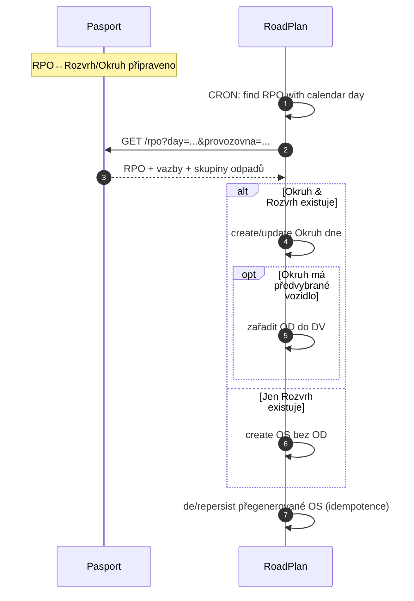
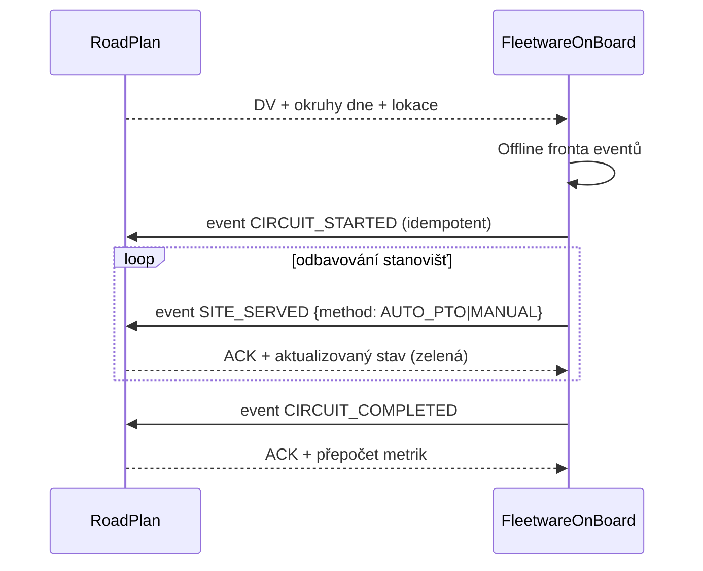
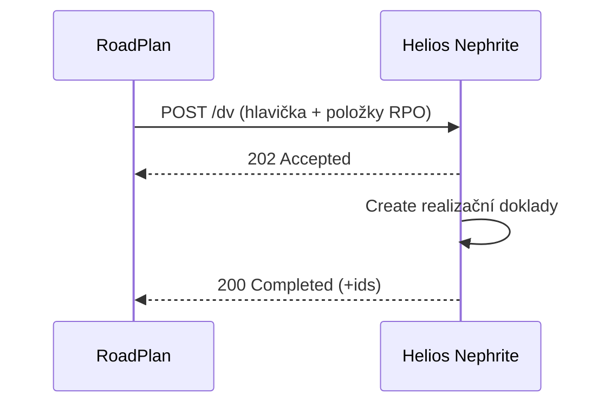

# PRD – Cyklické svozy MP SK (MVP Etapa 1 + Etapa 2)

**Úroveň důvěrnosti:** Chráněné  
**Zdrojový podklad:** <File>HLC Cyklické Svozy MP SK 2025.docx</File>   
**Verze PRD:** 1.0 (generováno 2026-02-11 12:33)

---

## 0. Účel dokumentu
Tento dokument shrnuje připravovaný projekt *Cyklické svozy* jako **základní PRD** pro řízení realizace a pro znalostní práci s využitím **agentní AI**. Struktura vychází z dodaného cílového konceptu a doplňuje jej o integrační specifikaci, datové kontrakty, provozní postupy a návrhy AI agentů. V místech, kde zdroj neupravuje detail, jsou přidány návrhy (**NÁVRH**) k diskuzi.  
Podklad popisuje rozšíření stávajících produktů **Pasport (PP)**, **RoadPlan (RP)** a **FleetwareOnBoard (FOB)** o plnohodnotnou podporu **cyklických svozů** a návazný export do **Helios Nephrite (HEN)**. 

---

## 1. Kontext a cíle
**Hlavní cíl:** umožnit plánování a realizaci cyklických svozů malých nádob od smluvních zákazníků s přesahem do strategické optimalizace okruhů, při zachování principu *jeden zdroj pravdy* a s důrazem na škálovatelnou integraci mezi PP, RP, FOB a HEN. 

**Měřitelné přínosy (OKR – NÁVRH):**
- Zkrácení doby sestavy denních výkonů (DV) o ≥30 % do 3 měsíců po spuštění MVP.  
- Snížení manuálních zásahů při tvorbě DV o ≥40 % díky generování **objednaných služeb (OS)** a **okruhů dne**.   
- Prokazatelné zvýšení transparentnosti realizace (monitoring, potvrzení obsluhy) – dostupnost stavu v reálném čase v RP/FOB. 

**Vysoká hodnota pro role:** management (analýzy, taktika/strategie), THP (podklady pro doklady), dispečer (plánování, monitoring), řidič (FOB), smluvní zákazník (veřejný web – později). 

---

## 2. Zúčastněné strany a odpovědnosti (RACI)
**Organizace:** Marius Pedersen, a.s. (MP SK – zadavatel), RADIUM (dodavatel FLW: PP, RP, FOB), D2B (dodavatel HEN). 

**Klíčové osoby:** <Person>M. Bulko</Person>, <Person>S. Kodajová</Person>, <Person>T. Stiksa</Person> (MP SK); <Person>V. Findejs</Person>, <Person>J. Komenda</Person>, <Person>M. Slivoně</Person>, <Person>Z. Slaný</Person>, <Person>E. Šťastná</Person>, <Person>M. Taraba</Person> (RADIUM). 

**RACI – zkratka:**
- **R**esponsible: RP/PP/FOB týmy za implementaci;  
- **A**ccountable: Produktový/Projektový manažer dodavatele;  
- **C**onsulted: MP SK, D2B (HEN);  
- **I**nformed: Provoz, vedení. (RACI – NÁVRH)

---

## 3. Rozsah (in/out)
**In scope (MVP/Etapa 1):**
- Datová základna v **PP**: evidence **okruhů, rozvrhů, zón** a vazeb na **revize položek objednávky (RPO)**; rozšířené filtry a mapové náhledy.   
- **RP**: generování **OS** z vazeb RPO↔Rozvrh/Okruh, práce s **okruhem dne**, sestava **DV**, monitoring realizace a potvrzení obsluhy; export podkladů do **HEN** pro realizační doklady.   
- **FOB**: nový modul **Cyklické svozy** s mapou stanovišť, obsluhou a offline frontou potvrzení.   
- **Integrace**: HEN→PP (číselníky a vazby), PP→RP (minimální set dat), RP→HEN (podklady pro realizaci); dočasně zachován MDB; nová REST API postupně. 

**In scope (Etapa 2):** Strategická optimalizace (SP), přechod správy okruhů pod PP, rozšíření map a FOB (navigace, incidenty), sběr váhy/objemu pro SP. 

**Out of scope (aktuálně):** Paralelní plné plánování DV v HEN i RP současně (otevřený bod), veřejný web pouze jako budoucí rozvoj. 

---

## 4. Architektonické principy a vlastnictví dat
- **Jeden zdroj pravdy (SoT):** PP – smluvní a statické vstupy (RPO, nádoby, okruhy/rozvrhy/zóny); RP – DV/OS, monitoring a výsledky realizace; HEN – ERP agenda a realizační doklady.   
- **Preference jednosměrných synchronizací** a **volného párování přes API**; žádné přímé čtení cizí DB.   
- **Centralizace logiky** (např. generování OS v RP).   
- **Synchronizovat jen nezbytné minimum** pro danou funkčnost. 

**Maticová tabulka SoT** (výňatek – NÁVRH na základě konceptu):

| Entita | SoT | Konzumenti |
|---|---|---|
| RPO (revize položky) | PP | RP |
| Okruh/Rozvrh/Zóna | Etapa 1: HEN → PP; Etapa 2: PP | RP, HEN |
| Objednaná služba (OS), Okruh dne, DV | RP | FOB, HEN |
| Stanoviště/Nádoba | PP | RP, FOB |
| Realizace DV (doklady) | HEN | – |  
(SoT a konzumenti vycházejí z kapitol *Doménový model*, *Zapojení systémů*, *Komunikace mezi systémy*.) 

---

## 5. Integrační toky (detailní specifikace)
### 5.1 Přehled služeb a kanálů
- **PP-sync-external-Helios** (REST + dočasně MDB): HEN→PP (číselníky okruhy/rozvrhy/zóny, kalendáře; vazby PZ↔okruh/rozvrh/zóna).   
- **PP-sync-external-RoadPlan** / **RP-sync-external-Pasport** (REST): PP↔RP přenos minimálního setu dat (RPO, nádoby/stanoviště, okruhy/rozvrhy, skupiny odpadu, parametry typů nádob).   
- **RP-sync-external-Helios** (REST + dočasně MDB): RP→HEN export DV a položek pro doklady.   
- **RP↔FOB**: obousměrná komunikace denních výkonů a událostí (HTTP(S)/WebSocket – NÁVRH dle současného FOB 2.0; offline fronta ve FOB). 

> **Pozn.:** Přechod z MDB na API je plánován po ověření rozhraní v praxi (Etapa 2+). 

### 5.2 Datové kontrakty (minimální)
#### 5.2.1 PP → RP: RPO a návaznosti
```json
{
  "rpoId": "string",
  "objednavkaId": "string",
  "konecnyPrijemce": "string",
  "mistoRealizace": {
    "adresa": "string",
    "geo": { "lat": 0.0, "lon": 0.0 }
  },
  "pocetNadob": 12,
  "typNadoby": "120L",
  "druhOdpadu": "200101",
  "skupinaOdpadu": "PAPIER",
  "okruhId": "string|null",
  "rozvrhId": "string|null",
  "kalendare": ["2026-03-03", "2026-03-10"],
  "nadoby": [
    {"id": "N-001", "stanovisteId": "S-001", "typ": "120L", "geo": {"lat":0.0, "lon":0.0}}
  ]
}
```
*(Atributy odpovídají minimálnímu setu potřebnému v RP: číslo RPO, příjemce, MR, počty/typy nádob, odpad/skupina, okruh/rozvrh, kalendářní dny.)* 

#### 5.2.2 RP → FOB: Denní výkon s okruhy dne
```json
{
  "dvId": "DV-2026-03-03-TR-001",
  "vozidloId": "5AX1258",
  "datum": "2026-03-03",
  "poznamka": "string",
  "okruhyDne": [
    {
      "okruhDneId": "OD-001",
      "okruhNazev": "KO – Nimnica, Visolaje",
      "stav": "PLANOVANO|ZAHÁJENO|PŘERUŠENO|UKONČENO|VYNECHÁNO",
      "lokace": [
        {"rpoId":"...","geo":{"lat":0.0,"lon":0.0},"typNadoby":"120L","pocet":4,"skupina":"KO"}
      ],
      "likvidacniMista": [{"id":"LM-01","adresa":"...","skupina":"KO"}]
    }
  ]
}
```
*(Stavy a obsah vycházejí z návrhu FOB modulu a práce s okruhy dne.)* 

#### 5.2.3 FOB → RP: Události realizace (idempotentní)
```json
{
  "eventId": "uuid",
  "dvId": "DV-...",
  "deviceTs": "2026-03-03T07:35:01Z",
  "type": "CIRCUIT_STARTED|CIRCUIT_PAUSED|CIRCUIT_COMPLETED|SITE_SERVED|SITE_UNSERVED",
  "payload": {
    "okruhDneId": "OD-001",
    "site": {"rpoId":"...","stanovisteId":"S-001"},
    "method": "AUTO_PTO|MANUAL",
    "offline": true
  }
}
```
*(FOB musí podporovat offline frontu, RP potvrzuje přijetí; barvy stavů v mapě: červená/žlutá/zelená.)* 

#### 5.2.4 RP → HEN: Export podkladů pro realizační doklady
```json
{
  "dvId": "DV-...",
  "vozidloId": "...",
  "datum": "2026-03-03",
  "hlavicka": {"provozovna":"...","km": 182, "casRealizaceMin": 412},
  "polozky": [
    {"rpoId":"...","stav":"REALIZOVÁNO|ZRUŠENO"}
  ]
}
```
*(RP je zdrojem pravdy pro DV/Trasu dne, HEN sestavuje doklady.)* 

### 5.3 Toky a sekvence (Mermaid)
#### 5.3.1 Generování objednaných služeb (automat)

*(Podmínky viz tabulka v kapitole generování OS.)* 

#### 5.3.2 Realizace DV s FOB (online/offline)

*(FOB zobrazuje červená/žlutá/zelená; potvrzení finálního stavu řídí RP.)* 

#### 5.3.3 Export realizace do HEN

*(RP poskytuje podklady pro doklady v HEN.)* 

### 5.4 NFR pro integrace
- **Výkon/objem:** ~150 vozidel, až ~600 OS/stanovišť na 1 DV; latence běžných operací v jednotkách sekund; škálování horizontální/vertikální.   
- **Dostupnost:** SaaS dle SLA; obnova RPO/RTO definována; FOB offline režim s opakovaným doručováním v rámci aktuálního dne.   
- **Bezpečnost:** TLS/mTLS, OAuth2 (client‑credentials – NÁVRH), šifrování dat v klidu i přenosu; audit logy.   
- **Observabilita:** korelační **X‑Correlation‑Id**, metriky (propustnost, chybovost, latence), ELK stack. 

### 5.5 Chybové stavy a odolnost (návrh)
- **Idempotence:** `eventId` (UUID) na všech FOB→RP událostech; `If-None-Match`/`ETag` pro PP→RP synchronizace.
- **Retry/backoff:** exponenciální s jitterem; dead‑letter queue pro nevratné chyby.
- **Transakční konzistence:** eventual consistency s kompenzačními akcemi (re‑generace OS, zrušení OD).  
- **Validace směšování odpadů:** pouze v rámci **skupiny odpadu**, nikoli napříč (viz doménový model a plánované mapování Druh↔Skupina). 

---

## 6. Doménový model (shrnutí)
- **Smlouvy/Objednávky:** RPO s vazbami na **okruh**, **rozvrh**, **zónu**; doplněna vazba **Druh ↔ Skupina odpadu** (řízení výběru pro plánování/SP).   
- **Objednané služby (OS) & Plány:** OS generované z RPO dle kalendáře rozvrhu; nová entita **Okruh dne**; DV je složen z okruhů dne. 

---

## 7. MVP (Etapa 1) – požadavky a přijetí
**PP:** správa číselníků (Rozvrhy, Okruhy, Zóny; Druhy↔Skupiny odpadu; čas obsluhy typu nádoby), rozšíření obrazovek RPO včetně mapy a vazeb, geokódování MR.   
**RP:** správa OS (CS), plánování DV přes **okruhy dne**, mapa DV/OD, monitoring a potvrzení realizace, generování OS (auto i manuální), export do HEN.   
**FOB:** modul **Cyklické svozy**, práce s okruhy, stanoviště, perimetr pro odbavení, automat po PTO, offline fronta. 

**Definition of Ready (DoR) – integrační user story (NÁVRH):**
- API specifikace v OpenAPI 3.0; schválené datové typy a slovníky.  
- Testovací účty a prostředí (vč. HEN) nastavena. (viz otevřený bod)   
- Mapování Druh↔Skupina odsouhlaseno všemi provozovnami. 

**Definition of Done (DoD) – integrační user story (NÁVRH):**
- Prošly integrační testy (pozitivní/negativní), zátěžový test s profilovaným objemem.  
- Metriky a logy viditelné v ELK; alerting nastaven.  
- Pilotní DV odgenerován → zobrazen ve FOB → potvrzen → exportován do HEN.

---

## 8. Strategická optimalizace (Etapa 2) – rámec
- **Cíl:** nástroj výpočtu sady okruhů dne (SOD) s hlavním kritériem **čas** a omezeními (pracovní doba, nosnost, objem).   
- **Data pro SP:** hustota odpadů, objemové zaplnění typů nádob, kapacity vozidel, pracovní doba; sběr přes FOB a RP, BI analýzy.   
- **Životní cyklus SP:** analýza → příprava dat → výpočet SOD → manuální editace → převod na standardní okruhy v PP/HEN. 

---

## 9. Ne-funkční požadavky (výňatek)
- **Výkon:** jednotky sekund pro běžné operace; dimenzování na 150 vozidel a až 600 stanovišť na DV.   
- **Dostupnost & zotavení:** dle SLA, definice RPO/RTO.   
- **Bezpečnost:** autentizace/autorizace, šifrování, ochrana proti běžným útokům.   
- **Použitelnost:** sjednocené UI/UX v rodině FLW, podpora map. 

---

## 10. Rizika a mitigace (shrnutí)
- **Výkonové problémy při nárůstu dat:** PoC, optimalizace dotazů, případně archivace dat.   
- **Overscoping:** MVP přístup, iterativní rozvoj.   
- **Třetí strany (D2B, optimalizační dodavatel):** jasné kompetence, pravidelná komunikace.   
- **Strategická optimalizace (kvalita výstupů):** předimplementační analýza, PoC, školení. 

---

## 11. Otevřené body k rozhodnutí
- **HEN testovací přístupy** pro dodavatele (D2B) – požadováno zřízení.   
- **Plánování DV paralelně v HEN i RP** – preferováno *buď–anebo* na úrovni provozovny; jinak vysoká komplexita konfliktů. 

---

## 12. Harmonogram (stav dle konceptu)
- Schůzky k funkčním požadavkům: 06/2025 (hotovo).  
- Schválení funkčních požadavků: 9.7.2025 (hotovo).  
- Příprava konceptu a fází řešení: 29.8.2025.  
- Schválení konceptu: 11.9.2025.  
- Podání nabídky: 6.10.2025.  
- Návrh řešení I. fáze: 12/2025.  
*(Termíny a stav dle tabulky v konceptu.)* 

---

## 13. Agentní AI – návrh provozních agentů a znalostní práce
**Zásady:** RAG nad zdrojovými artefakty (koncept, datové kontrakty, API), řízené prompt‑šablony, audit stopa, bezpečnost dle klasifikace *Chráněné*. (NÁVRH)

**Katalog agentů (NÁVRH):**
1) **Integration Guardian** – hlídá dostupnost API, schema drift, chybovost; navrhuje rollback/opravné migrace.  
2) **Planning Copilot** – asistuje dispečerům při sestavě DV (doporučuje přiřazení OD→vozidla, upozorňuje na střety skupin odpadu).  
3) **Reconciliation Agent** – porovnává FOB události s RP stavem; navrhuje doplnění chybějících potvrzení po offline období.  
4) **Data Steward Agent** – kontrola kvality RPO (souřadnice MR vs. stanovišť, zóny, mapování Druh↔Skupina).  
5) **SP Analyst** – asistuje při volbě parametrů strategické optimalizace a kontroluje naplnění kritérií.  

**Zdroje znalostí:** <File>HLC Cyklické Svozy MP SK 2025.docx</File>, API smlouvy (OpenAPI), datové slovníky (Druhy/Skupiny), protokoly RP/FOB/HEN. 

**Ukázková prompt‑šablona (Integration Guardian – NÁVRH):**
```text
Úkol: Zkontroluj chyby v toku PP→RP za posledních 24 h.
Vstupy: /metrics, /logs (korelace X-Correlation-Id), schémata OpenAPI.
Kroky: 1) vyčíslit error‑rate a top endpointy; 2) validovat payload proti schématu; 3) pokud schema‑drift, vygeneruj návrh migrace a testů.
Výstup: Souhrn + akční seznam (JIRA odkazy).
```

---

## 14. Akceptační kritéria (příklady)
- Dispečer dokáže pro vybranou provozovnu a den **automaticky** vygenerovat OS a OD a sestavit DV; minimálně 90 % OS je přiřazeno k OD bez manuálních zásahů.   
- Řidič ve FOB odbaví stanoviště s automatickým potvrzením přes PTO nebo manuálně; RP reflektuje stav v reálném čase a umožní potvrzení DV i s neobslouženými OS (s upozorněním).   
- Export realizace do HEN vytvoří doklady bez manuálního doplňování položek. 

---

## 15. Přílohy a zdroje
- Cílový koncept – <File>HLC Cyklické Svozy MP SK 2025.docx</File>.   
- Wireframy PP/RP/FOB (součást konceptu). 

---

> **Poznámka k citacím:** Značka `` odkazuje na zdrojový dokument uvedený výše.
