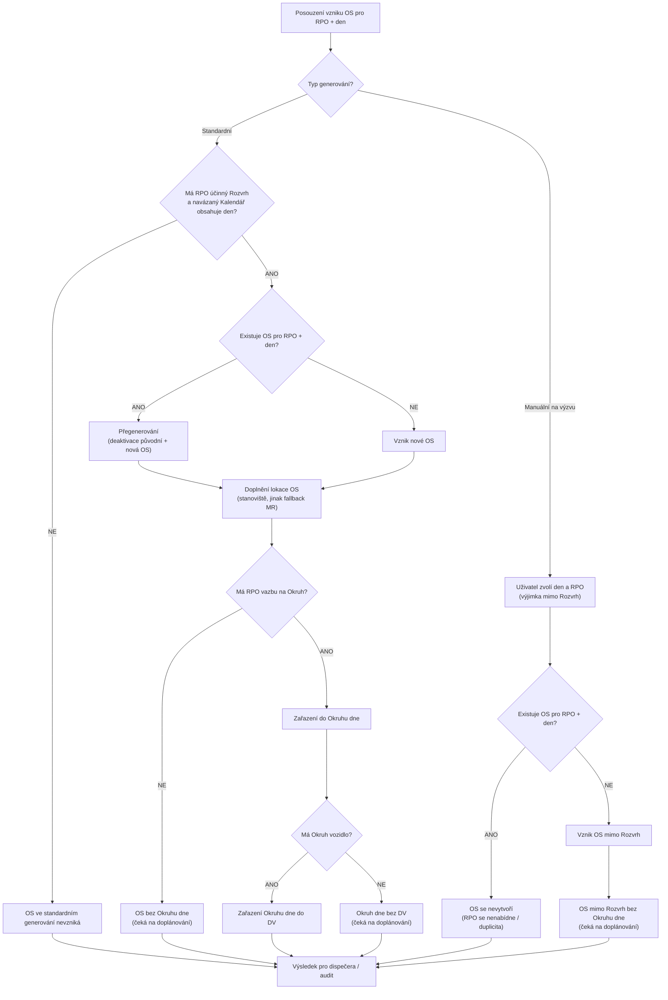

# Generování OS

## 1. Businessové shrnutí

Generování objednaných služeb (OS) je klíčový proces, který převádí data z revizí položek objednávek (RPO), rozvrhů a okruhů do provozně použitelných jednotek pro denní plánování v RoadPlan (RP).

Z business pohledu platí:
- RP pracuje primárně s entitou objednaná služba (OS), která představuje konkrétní realizaci služby v konkrétní den.
- OS vznikají z RPO na základě vazeb na Rozvrh a Okruh; nově vzniká také entita „Okruh dne", která sdružuje OS pro Denní výkon.
- Nutnou podmínkou pro automatické vygenerování OS je vazba RPO na Rozvrh; konkrétní dny generování určuje Kalendář navázaný na Rozvrh.
- Vazba RPO na Okruh a případně přiřazené vozidlo určuje míru automatizace: od pouhého vzniku OS až po automatické zařazení do Okruhu dne a Denního výkonu.
- Proces generování může běžet automaticky (konfigurovaně) i manuálně; manuální spuštění slouží zejména dispečerovi pro operativní zásah.
- Výstupem generování nejsou jen OS, ale i jejich lokace, Okruhy dne a případně Denní výkony, aby dispečer dostal připravená data pro finální plánování.
- Při změně vstupních dat (RPO/nádoby) systém podporuje přegenerování: původní OS deaktivuje, vytvoří nové a přegenerované záznamy následně čistí.
- Je podporováno i manuální generování OS „na výzvu" bez vazby na Rozvrh pro mimořádné svozy, reklamace a podobné situace.

Hlavní business přínos procesu je zrychlení a standardizace přípravy dat pro dispečink, snížení ruční práce při sestavování denních výkonů a jasné oddělení rolí mezi zdrojovými daty (RPO/rozvrhy/okruhy) a operativním plánováním v RP.

## 2. Shrnuté za HELIOS (analogie generování podkladu k plánu realizace)

Z pohledu HELIOS Nephrite (modul ZVOZ) existuje velmi podobná logika přípravy podkladů pro realizaci, která je analogická k našemu generování OS v PP/RP:

- V HEN je zdrojovou entitou **Predmet zmluvy (PZ)**, která je analogická našemu `RPO` jako vstupní jednotce pro plánování.
- Podklad pro plán realizace v HEN vzniká kombinací:
  - **Rozvrhu vývozu** (kalendář / dny vývozu),
  - **Zóny** (geografické seskupení podle adres stanoviska),
  - **Okruhu trasy** (plánovací seskupení PZ),
  - vazeb PZ na tyto entity.
- **Rozvrh** je v HEN na PZ veden jako **dynamický vztah** (nikoli jen atribut na PZ), což je důležitá analogie k našemu návrhu vazebních entit / historizovaných vazeb.
- **Zóna** je v HEN na PZ doplňována podle **adresy stanoviska** (statická vazba na stanovisku + odvození na PZ), což odpovídá potřebě rozlišovat zdroj lokace a odvozené údaje.
- **Okruh trasy** v HEN slouží jako stavební prvek pro plánování **Trasy dňa**, obdobně jako u nás `Okruh dne` a následně `Denní výkon`.
- V HEN lze při plánování Trasy dňa použít režim **„Pridať podľa rozvrhu“**, tj. systémový výběr položek podle Rozvrhu (a volitelně Okruhu). To je funkčně blízké našemu cíli automaticky připravit OS/okruhy dne pro dispečera.
- HEN při plánování hlídá duplicity položek pro stejný den/útvar, což je analogické našemu pravidlu nevytvářet duplicitní OS pro stejný den.
- HEN rozlišuje původ položek v realizaci (`Podľa rozvrhu`, `Mimo rozvrh`, `Presunuté na iný deň`), což je dobrá inspirace pro evidenci původu OS a přegenerování/přeplánování v RP.

Shrnutí analogie pro PP/RP:
- HEN ukazuje, že „generování podkladu k plánu realizace“ není jen vytvoření seznamu položek, ale kombinace **zdrojové entity + kalendáře/rozvrhu + geografického kontextu + seskupení do plánovací jednotky**.
- Pro náš návrh to potvrzuje směr generování OS jako předpřipraveného podkladu pro finální plánování (ne jako finální plán samotný).
- Zároveň to upozorňuje na kritické oblasti k dopracování: samostatnost vazeb, historizace, odvozené atributy Okruhů a pravidla pro položky mimo Rozvrh / přesuny.

## 3. Navrhované workflow (dle cílového konceptu)

### 3.1 WF-PP-01 Standardní workflow generování OS

1. Vstupem jsou RPO a související vazby/číselníky potřebné pro plánovací kontext:
   - vazba na Rozvrh a navázaný Kalendář (kalendářní dny),
   - vazba na Okruh (pokud existuje),
   - nádoby a lokace stanovišť,
   - zóna (pokud je k dispozici; typicky jako pomocný/odvozený údaj).
2. Generování se spouští automaticky podle konfigurace (frekvence, čas, období), případně manuálně oprávněným uživatelem.
3. Systém vybere RPO s účinnou vazbou na Rozvrh, jehož navázaný Kalendář obsahuje den v generovaném období.
4. Systém projde relevantní Rozvrhy / kalendářní dny a pro vybraná RPO generuje OS a jejich lokace.
5. Podle vazby na Okruh systém:
   - zařadí OS do existujícího Okruhu dne, nebo
   - založí nový Okruh dne.
6. Pokud je Okruhu přiřazeno vozidlo, Okruh dne se automaticky zařadí do Denního výkonu (DV) vozidla.
7. Dispečer dostane připravená data (OS, lokace, Okruhy dne, případně DV) jako **podklad pro finální operativní plánování**.

### 3.2 WF-PP-02 Manuální workflow generování OS

- Manuální spuštění generování z Okruhů a Rozvrhů:
  - spouští oprávněný uživatel synchronně,
  - platí stejné podmínky jako u automatu,
  - dispečer může omezit období a výběr na konkrétní Rozvrhy/Okruhy,
  - po doběhu systém vrátí souhrn (počty RPO, OS, lokací, Okruhů).

- Manuální generování na výzvu z RPO (mimořádné svozy):
  - používá se bez vazby na Rozvrh (např. výzva/reklamace),
  - uživatel vybírá konkrétní den,
  - systém nabídne jen RPO bez existující OS pro tento den,
  - pokud je RPO v Okruhu, Okruh se ignoruje a vzniká OS bez zařazení do Okruhu dne.
- Manuální workflow má sloužit i jako nástroj pro operativní doplnění podkladu k plánu (analogicky k položkám „mimo rozvrh“ v HEN), nikoli pouze k opravě technických chyb.

### 3.3 Dopad na roli dispečera

- Dispečer neřeší ruční zakládání všech OS, ale pracuje s předpřipravenou sadou dat.
- Jeho role se posouvá na kontrolu, finální sestavení Okruhů dne a DV a řešení výjimek.
- Součástí role dispečera je i kontrola kvality podkladu (vazby na Rozvrh/Okruh, původ OS, chybějící lokace a fallbacky).
- Míra ruční práce závisí na kvalitě vazeb RPO -> Rozvrh -> Okruh a na přiřazení vozidel k Okruhům.

## 4. Vstupní data a podmínky

Tato kapitola sjednocuje pohled na vstupní data pro generování OS na základě:
- `docs/datovy-model/datovy-model-PP.md` (analytický / konceptuální model pro CS),
- `docs/datovy-model/inventar-entit-PP.md` (aktuální inventář entit PP / DS / DDL).

Pro potřeby tohoto dokumentu platí terminologické sjednocení:
- `RPO` = business zkratka pro **Revizi položky objednávky** (inventář PP: `order_item_revision`),
- názvy `Okruh`, `Rozvrh`, `Kalendář`, `Zóna` používáme jako CS entity z analytického modelu (v inventáři PP jsou vedeny jako nové entity pro CS, zatím mimo aktuální DS/DDL).

### 4.1 Přehled vstupních entit pro generování OS

| Entita (v tomto dokumentu) | Zdroj / mapování | Role při generování OS | Povinnost pro generování | Poznámka |
|---|---|---|---|---|
| `RPO` | `datovy-model-PP`: `RPO`; `inventar-entit-PP`: Revize položky objednávky (`order_item_revision`) | Primární business vstup pro vznik OS (služba v konkrétní den) | Ano | Nese obchodní kontext, adresu MR, odpad, provozovnu, vazby do plánovacího kontextu. |
| `RPO_Okruh_Rozvrh` | `datovy-model-PP`: temporální vazební entita | Účinné přiřazení RPO do Rozvrhu a Okruhu s historií | Ano pro standardní větev | Klíčové pro vyhodnocení standardního generování; v inventáři PP není explicitně uvedeno jako existující DS/DDL entita. |
| `Rozvrh` | `datovy-model-PP`; `inventar-entit-PP` kap. 23 (nové pro CS) | Řídí dny, ve kterých se má OS generovat | Ano pro standardní větev | Vazba `RPO -> Rozvrh` je business podmínkou standardního generování. |
| `Kalendář` | `datovy-model-PP`; `inventar-entit-PP` kap. 23 (nové pro CS) | Obsahuje konkrétní kalendářní dny navázané na Rozvrh | Ano pro standardní větev | Konkrétní den vzniku OS je určen Kalendářem navázaným na Rozvrh. |
| `Okruh` | `datovy-model-PP`; `inventar-entit-PP` kap. 23 (nové pro CS) | Určuje automatické zařazení OS do Okruhu dne | Ne | Nepovinný pro vznik OS, ale ovlivňuje míru automatizace (`BR-PP-03`, `BR-PP-04`). |
| `Zóna` | `datovy-model-PP`; `inventar-entit-PP` kap. 23 (nové pro CS) | Pomocný/filtrační geografický kontext | Ne | Není podmínkou vzniku OS (`BR-PP-05`). |
| `Nádoba` | `datovy-model-PP`: `Nádoba`; `inventar-entit-PP`: `container` | Provozní objekt pro lokalizaci a kontext obsluhy | Podmíněně | Vstupuje zejména do generování lokací OS; při absenci lokalizační vazby se používá fallback přes MR. |
| `Nadoba_Stanoviste` / Přiřazení nádoby ke Stanovišti | `datovy-model-PP`: `Nadoba_Stanoviste`; `inventar-entit-PP`: `site_container_assignment` | Časově platná vazba pro primární lokalizaci OS přes Stanoviště | Podmíněně | Primární zdroj lokalizace OS (pokud existuje aktivní vazba). |
| `Stanoviště` | `datovy-model-PP`: `Stanoviště`; `inventar-entit-PP`: `site` | Primární lokalizační entita pro OS | Podmíněně | Vazba na RPO je nepřímá přes Nádobu a vazební entitu. |
| `Adresa` (místo realizace RPO) | `datovy-model-PP`: `Adresy`; `inventar-entit-PP`: `address` | Fallback lokalizace OS / MR | Ano (pro fallback) | Používá se při chybějícím Stanovišti/Nádobě (`BR-PP-05`). |
| `Skupina odpadu` | `datovy-model-PP`: `Skupina odpadu`; `inventar-entit-PP`: `garbage_group` | Seskupovací a validační/plánovací kontext | Ano pro konzistentní plánování | Ovlivňuje pravidlo „1 Okruh dne = 1 skupina odpadu“ (`BR-PP-05`). |
| `Provozovna` | `datovy-model-PP`: atributy na více entitách; `inventar-entit-PP`: `organization_unit` | Scope dat, oprávnění a běhu generování | Ano | Slouží k omezení rozsahu dat a governance manuálního generování. |

### 4.2 Mapování a poznámky k entitám mezi datovým modelem a inventářem PP

- `RPO` v tomto dokumentu odpovídá businessově entitě **Revize položky objednávky** z inventáře PP (`order_item_revision`).
- Analytický model (`datovy-model-PP.md`) používá zjednodušený / konceptuální zápis vazby `RPO -> Nádoba`; inventář PP ukazuje existující technickou vazbu přes entitu **Přiřazení nádoby k položce objednávky** (`container_order_item_assignment`).
- Pro generování OS se proto v tomto dokumentu používá businessový pojem „Nádoba navázaná na RPO“, bez fixace na finální technickou realizaci vazby v PP DS/DDL.
- Entity `Okruh`, `Rozvrh`, `Kalendář`, `Zóna` jsou v inventáři PP explicitně vedeny jako **nové pro CS** (zatím mimo aktuální DS/DDL); jejich finální umístění (PP vs. RP) zůstává otevřeným bodem.

### 4.3 Podmínky připravenosti vstupních dat pro generování OS

Obecné podmínky:
- Musí existovat identifikovatelné `RPO` v odpovídajícím scope (zejména Provozovna) a s dostupným minimálním plánovacím kontextem.
- Systém musí být schopen vyhodnotit lokalizaci OS:
  - primárně přes `Nádoba -> Nadoba_Stanoviste -> Stanoviště`,
  - fallback přes `Adresa` místa realizace na RPO.
- Systém musí být schopen provést kontrolu duplicity pro kombinaci `RPO + den` (`BR-PP-08`).

Podmínky pro standardní generování (návaznost na `WF-PP-01`, `BR-PP-01`, `BR-PP-02`, `BR-PP-04`):
- `RPO` má účinnou vazbu na `Rozvrh` (typicky přes `RPO_Okruh_Rozvrh`).
- `Kalendář` navázaný na daný `Rozvrh` obsahuje konkrétní den v generovaném období.
- `Okruh` a údaj o Vozidle jsou volitelné vstupy; ovlivňují pouze míru automatizace dokončení podkladu (`BR-PP-03`, `BR-PP-04`).

Podmínky pro manuální generování z Rozvrhů/Okruhů (návaznost na `WF-PP-02`):
- Platí stejné business podmínky vstupních dat jako pro standardní generování.
- Rozdíl je ve způsobu spuštění a omezení rozsahu (výběr období / Rozvrhů / Okruhů), nikoli v jádru business logiky (`BR-PP-01` až `BR-PP-09`).

Podmínky pro manuální generování „na výzvu“ z RPO (návaznost na `WF-PP-02`, větev „na výzvu“, `BR-PP-02`, `BR-PP-07`, `BR-PP-08`):
- Uživatel explicitně zvolí `RPO` a konkrétní den.
- Vazba na `Rozvrh` a `Kalendář` není podmínkou vzniku OS.
- Pro zvolenou kombinaci `RPO + den` nesmí existovat OS; jinak se RPO nenabízí / OS se nevytvoří.

### 4.4 Otevřené body navázané na vstupní data

- Finální technická reprezentace vazeb `RPO ↔ Okruh ↔ Rozvrh` a jejich platností (včetně umístění entit) je dále řešena v `7.1` a `7.6`.
- Architektonické umístění entit `Okruh`, `Rozvrh`, `Kalendář`, `Zóna` (PP vs. RP) zůstává otevřené a má přímý dopad na integrační kontrakt i generování OS (viz `7.1`, `7.5`, `7.6`).
- Pravidla validace kvality vstupních dat (např. konzistence skupin odpadu v Okruhu) jsou rozpracována v `7.3`.

## 5. Business pravidlo generování OS

Tato kapitola definuje společné business pravidlo generování OS, na které se bude odkazovat v dalších Use Cases (standardní i manuální generování). Cílem je oddělit:
- **co je závazná business logika vzniku OS**,
- od **způsobu spuštění** (automat / manuál),
- a od **UI / procesních kroků** konkrétního use case.

### 5.1 Základní business pravidlo (jádro)

- `BR-PP-01` (Definice a den plánování): Objednaná služba (`OS`) představuje realizaci služby pro konkrétní `RPO` v konkrétní den; u standardního generování je tento den určen entitou **Kalendář** navázanou na **Rozvrh** (Kalendář obsahuje kalendářní dny plánování).
- `BR-PP-02` (Podmínky vzniku OS): Vznik OS se řídí režimem generování:
  - **standardní generování**: OS může vzniknout pouze tehdy, pokud má RPO účinnou vazbu na Rozvrh a Kalendář navázaný na tento Rozvrh obsahuje daný den v generovaném období,
  - **manuální generování na výzvu**: OS může vzniknout i bez vazby na Rozvrh, pokud oprávněný uživatel explicitně zvolí den a RPO a pro daný den ještě neexistuje OS.
- `BR-PP-03` (Míra automatizace vs. vznik): Vazba na **Okruh** ani přiřazení **Vozidla** nejsou nutnou podmínkou vzniku OS; určují pouze míru automatického dokončení podkladu (zařazení do Okruhu dne a případně do DV).

### 5.2 Rozhodovací logika a dopady na výsledek

- `BR-PP-04` (Rozhodovací logika plánovacího zařazení): Rozvrh spolu s navázaným Kalendářem rozhoduje o způsobilosti RPO pro standardní generování v konkrétní den; Okruh rozhoduje o zařazení do **Okruhu dne** a přiřazení Vozidla k Okruhu rozhoduje o automatickém propsání do **Denního výkonu (DV)**.
- `BR-PP-05` (Plánovací kontext a konzistence dat): Zóna slouží jako pomocný/filtrační kontext a sama o sobě nevytváří ani neblokuje vznik OS; lokalizace OS se primárně odvozuje ze stanoviště nádoby (jinak fallback z místa realizace RPO); Okruh dne obsahuje pouze OS jedné skupiny odpadu.

### 5.3 Povolené výsledky generování (business pohled)

- `BR-PP-06` (Validní business výsledky): Za validní výsledek generování se považují všechny následující stavy:
  - vznik OS + lokace + zařazení do Okruhu dne + zařazení do DV,
  - vznik OS + lokace + zařazení do Okruhu dne bez DV,
  - vznik OS + lokace bez zařazení do Okruhu dne (čeká na doplánování),
  - nevznik OS při standardním generování, pokud RPO nesplní podmínku Rozvrhu/Kalendáře.
- `BR-PP-07` (Výjimková větev manuálního generování): Manuální generování „na výzvu“ je samostatná business větev pro operativní potřeby (mimořádné svozy, reklamace apod.) a nemá být zaměňováno se standardním generováním dle Rozvrhu; v této větvi je duplicita pro `RPO + den` důvodem k nenabídnutí / nevytvoření OS.
- Scénáře „bez DV“ a „bez Okruhu dne“ nejsou samy o sobě chyba; jsou to businessově validní mezistavy připraveného podkladu.

### 5.4 Pravidla konzistence, duplicity a auditovatelnosti

- `BR-PP-08` (Duplicitní vznik a přegenerování): Pro kombinaci `RPO + den` může vzniknout nejvýše jedna aktivní OS v rámci jednoho typu vzniku (standardní vs. mimořádný); systém musí bránit duplicitnímu vzniku OS v rámci běhu a při opakovaných bězích použít režim přegenerování. Přegenerování musí být auditovatelné:
  - původní OS je deaktivována a označena jako přegenerovaná,
  - nová OS vzniká jako aktuální platný podklad,
  - navazující cleanup řeší odstranění/úklid neaktivních přegenerovaných vazeb.
- `BR-PP-09` (Audit a evidence původu): Business evidence má podporovat audit a operativní práci dispečera minimálně přes evidenci původu OS (např. `dle Rozvrhu`, `mimo Rozvrh`, `přegenerováno`, `přeplánováno`) a u manuálního spuštění evidenci kdo/kdy/v jakém rozsahu spouštěl generování a s jakým výsledkem (počty RPO/OS/lokací/Okruhů, varování/chyby).

### 5.5 Použití pravidla v navazujících Use Cases

- Use Cases pro **standardní generování** a **manuální generování** se mají odkazovat na tuto kapitolu jako na společný zdroj rozhodovací logiky (`BR-PP-01` až `BR-PP-09`).
- V jednotlivých Use Cases se pak popisují už jen:
  - aktér a trigger (scheduler / oprávněný uživatel),
  - vstupní parametry spuštění,
  - kroky UI/procesu,
  - chybové a výjimečné stavy specifické pro daný způsob spuštění.
- Tím se zabrání duplicitám a rozporům v popisu pravidel typu „Rozvrh + Kalendář = nutná podmínka standardního vzniku OS“ nebo „Okruh/Vozidlo = míra automatizace, nikoli podmínka vzniku OS“.

Tabulka mapování workflow na business pravidla (pro budoucí Use Cases):

| WF kód | Workflow / varianta | Relevantní BR | Poznámka pro UC |
|---|---|---|---|
| `WF-PP-01` | Standardní workflow generování OS | `BR-PP-01`, `BR-PP-02`, `BR-PP-03`, `BR-PP-04`, `BR-PP-05`, `BR-PP-06`, `BR-PP-08`, `BR-PP-09` | `BR-PP-07` použít jako hranici (co už patří do manuální výjimkové větve). |
| `WF-PP-02` | Manuální workflow z Rozvrhů/Okruhů | `BR-PP-01`, `BR-PP-02`, `BR-PP-03`, `BR-PP-04`, `BR-PP-05`, `BR-PP-06`, `BR-PP-08`, `BR-PP-09` | Stejná business logika jako standard, ale jiný aktér, trigger a rozsah spuštění. |
| `WF-PP-02` | Manuální workflow „na výzvu“ | `BR-PP-01`, `BR-PP-02`, `BR-PP-03`, `BR-PP-05`, `BR-PP-07`, `BR-PP-08`, `BR-PP-09` | `BR-PP-04` a `BR-PP-06` se použijí jen částečně (mimo standardní Rozvrh/Kalendář větev). |

### 5.6 Diagram pravidla

## 6. Případy užití (Use Cases)

Tato kapitola formalizuje případy užití, které dokument pokrývá. Standardní workflow jsou převzata z kapitoly 3 (`WF-PP-01`, `WF-PP-02`); pro potřeby specifikace UC jsou doplněna návrhová alternativní a výjimková workflow.

### 6.1 UC-PP-01 Standardní generování OS (automat)

- Cíl UC: Automaticky připravit podklad pro dispečera (OS, lokace, Okruhy dne, případně DV) ze způsobilých RPO v generovaném období.
- Primární aktér: Scheduler / systémový proces.
- Trigger: Plánované spuštění dle konfigurace.
- Standardní workflow: `WF-PP-01` (kap. 3.1).
- Relevantní BR: `BR-PP-01`, `BR-PP-02`, `BR-PP-03`, `BR-PP-04`, `BR-PP-05`, `BR-PP-06`, `BR-PP-08`, `BR-PP-09`.

Standardní průběh:
- Systém provede generování dle `WF-PP-01`.
- Výstupem je podklad pro dispečera v některém z validních stavů dle `BR-PP-06`.

Alternativní workflow (návrh):
- `AWF-PP-01A`: RPO splní podmínku Rozvrhu/Kalendáře, ale nemá vazbu na Okruh -> vznikne OS + lokace bez Okruhu dne; položka čeká na doplánování (`BR-PP-03`, `BR-PP-04`, `BR-PP-06`).
- `AWF-PP-01B`: RPO je v Okruhu, ale Okruh nemá Vozidlo -> vznikne Okruh dne bez DV; výsledek je validní mezistav (`BR-PP-03`, `BR-PP-04`, `BR-PP-06`).
- `AWF-PP-01C`: Chybí stanoviště nádoby -> lokalizace OS se doplní fallbackem z místa realizace RPO (`BR-PP-05`).

Výjimkové workflow (návrh):
- `EWF-PP-01A`: RPO nesplní podmínku Rozvrhu/Kalendáře -> OS ve standardním generování nevznikne; jde o validní business výsledek, nikoli technickou chybu (`BR-PP-02`, `BR-PP-06`).
- `EWF-PP-01B`: Pro `RPO + den` již existuje OS -> systém použije režim přegenerování (deaktivace původní OS, vznik nové OS, audit) dle `BR-PP-08`.
- `EWF-PP-01C`: Porušení validačního pravidla přiřazení do Okruhu / skupiny odpadu -> reakce (blokace vs. varování) bude upřesněna v otevřeném bodu `7.3`; UC má počítat s oběma variantami.

Výstup UC:
- Připravená data pro operativní plánování a audit běhu generování.

### 6.2 UC-PP-02 Manuální generování OS z Rozvrhů/Okruhů

- Cíl UC: Umožnit oprávněnému uživateli spustit generování OS nad vybraným rozsahem (období, Rozvrhy, Okruhy) se stejnou business logikou jako automat.
- Primární aktér: Oprávněný uživatel (dispečer / role dle governance).
- Trigger: Ruční synchronní spuštění.
- Standardní workflow: `WF-PP-02` (kap. 3.2), větev „Manuální spuštění generování z Okruhů a Rozvrhů“.
- Relevantní BR: `BR-PP-01`, `BR-PP-02`, `BR-PP-03`, `BR-PP-04`, `BR-PP-05`, `BR-PP-06`, `BR-PP-08`, `BR-PP-09`.

Standardní průběh:
- Uživatel zadá rozsah spuštění (období, výběr Rozvrhů/Okruhů).
- Systém provede generování se stejnými business pravidly jako `WF-PP-01`.
- Po doběhu systém vrátí souhrn výsledku běhu (počty, varování, chyby) dle `BR-PP-09`.

Alternativní workflow (návrh):
- `AWF-PP-02A`: Uživatel spustí generování jen pro podmnožinu Rozvrhů/Okruhů -> generování proběhne pouze nad vybraným rozsahem, ostatní data nejsou dotčena.
- `AWF-PP-02B`: Výsledkem běhu jsou pouze částečně dokončené podklady (např. bez Okruhu dne nebo bez DV) -> výsledek je validní dle `BR-PP-06`.
- `AWF-PP-02C`: V průběhu manuálního běhu systém narazí na existující OS pro `RPO + den` -> provede přegenerování dle `BR-PP-08`.

Výjimkové workflow (návrh):
- `EWF-PP-02A`: Uživatel nemá oprávnění ke spuštění manuálního generování -> systém akci zamítne a zaloguje pokus (návaznost na governance; otevřený bod `7.4`).
- `EWF-PP-02B`: Zadaný rozsah překročí provozní limit (období / počet Rozvrhů) -> systém běh nepovolí nebo vyžádá potvrzení dle budoucích pravidel governance (otevřený bod `7.4`, `7.6`).
- `EWF-PP-02C`: Současný běh koliduje s jiným generováním nad stejným rozsahem -> systém běh odmítne / odloží; přesné chování bude dopracováno v provozních parametrech (otevřený bod `7.6`).

Výstup UC:
- Manuálně vyvolaný běh generování s auditovatelným výsledkem a souhrnem pro uživatele.

### 6.3 UC-PP-03 Manuální generování OS „na výzvu“ z RPO

- Cíl UC: Operativně vytvořit OS pro mimořádný svoz / reklamaci i bez vazby na Rozvrh.
- Primární aktér: Oprávněný uživatel (dispečer / role dle governance).
- Trigger: Ruční synchronní spuštění „na výzvu“.
- Standardní workflow: `WF-PP-02` (kap. 3.2), větev „Manuální generování na výzvu z RPO“.
- Relevantní BR: `BR-PP-01`, `BR-PP-02`, `BR-PP-03`, `BR-PP-05`, `BR-PP-06`, `BR-PP-07`, `BR-PP-08`, `BR-PP-09`.

Standardní průběh:
- Uživatel zvolí konkrétní den a RPO pro mimořádný zásah.
- Systém ověří, že pro `RPO + den` ještě neexistuje OS.
- Systém vytvoří OS mimo Rozvrh a připraví ji k doplánování.

Alternativní workflow (návrh):
- `AWF-PP-03A`: RPO je přiřazeno do Okruhu -> při „na výzvu“ větvi se Okruh ignoruje a vzniká OS bez Okruhu dne (`BR-PP-07`).
- `AWF-PP-03B`: Chybí stanoviště nádoby -> lokalizace OS se doplní fallbackem z místa realizace RPO (`BR-PP-05`).
- `AWF-PP-03C`: Uživatel vytváří více mimořádných OS postupně pro různé dny -> každý běh se posuzuje samostatně podle kombinace `RPO + den` (`BR-PP-01`, `BR-PP-08`).

Výjimkové workflow (návrh):
- `EWF-PP-03A`: Pro vybranou kombinaci `RPO + den` již existuje OS -> systém RPO nenabídne / nevytvoří OS (`BR-PP-07`, `BR-PP-08`).
- `EWF-PP-03B`: Uživatel nemá oprávnění pro manuální generování „na výzvu“ -> systém akci zamítne a zaloguje pokus (otevřený bod `7.4`).
- `EWF-PP-03C`: Vybraný den nebo RPO jsou neplatné / nedostupné -> systém běh neprovede a vrátí validační chybu vstupu.

Výstup UC:
- Auditovatelně vytvořená OS mimo Rozvrh jako podklad pro operativní doplánování.

## 7. Otevřené body / rozhodnutí k dopracování

### 7.1 Platnost Rozvrhů a přiřazení (zásadní pro generování)

- Upřesnit datový model a pravidla pro `platnost Rozvrhu` (v CK je uvedeno jako bod k dopracování).
- Upřesnit práci s `platností přiřazení RPO -> Okruh` a `RPO -> Rozvrh`:
  - v HEN chybí časový údaj „od kdy“,
  - v PP se zavádí vlastní platnost,
  - v Etapě 1 má být platnost nepovinná.
- Rozhodnout, jak se platnost promítne do generování OS při změnách v průběhu období (od kdy přegenerovat, co ponechat).
- Potvrdit, zda má být vazba na Rozvrh v PP/RP chápána striktně jako samostatná (dynamická) vazba i v integračním kontraktu, nebo zda bude přenášena ve zploštěné podobě.

### 7.2 Pravidla pro změny v HEN a dopad na přegenerování OS

- HEN umožňuje editaci RPO i do minulosti; je potřeba potvrdit:
  - zda generování/přegenerování sahá i do minulých dnů,
  - jaké období je chráněné před automatickými zásahy,
  - jak se budou evidovat a auditovat přegenerované OS.
- Přidání/odebrání RPO z Okruhu v HEN nevytváří novou verzi RPO:
  - je nutné definovat, podle čeho RP bezpečně pozná změnu a spustí odpovídající přegenerování.
- Naopak některé materiální změny v HEN verziují PZ/RPO (např. změna Rozvrhu / typu nádoby); je nutné popsat, jak se tato historizace propíše do pravidel přegenerování na straně PP/RP.

### 7.3 Validace business pravidel při generování

- HEN nevaliduje logiku přiřazení RPO do Okruhu; potvrdit, která validační pravidla musí být v RP/FLW povinná.
- HEN nevaliduje skupiny/druhy odpadu v Okruhu; dopracovat konkrétní validaci na straně FLW/RP:
  - kdy generování zablokovat,
  - kdy pouze varovat dispečera.
- Dodefinovat validaci a původ hodnoty `zóna` na RPO (odvození z adresy stanoviska vs. ruční zásah), včetně reakce na nesoulad mezi adresou stanoviska a přiřazenou zónou.
- Potvrdit finální pravidla pro vznik „fiktivního Okruhu dne“ a kdy má být použité jako default.

### 7.4 Governance manuálního generování

- Potvrdit oprávnění a role pro manuální spuštění generování (CK uvádí doporučení omezit počet uživatelů).
- Dodefinovat provozní pravidla:
  - kdo může spouštět generování za provozovnu,
  - zda bude potřeba schvalování / logování spuštění,
  - limity rozsahu (období, počet Rozvrhů) kvůli výkonu a riziku kolizí.
- Potvrdit, jak se v UI a auditu rozliší manuálně vytvořené OS „mimo Rozvrh“ od OS vzniklých standardním generováním.

### 7.5 Paralelní plánování HEN vs. RP

- Otevřený bod z CK: nutnost paralelního plánování v HEN i RP.
- Rozhodnutí je kritické pro workflow generování OS, protože ovlivňuje:
  - kdo je finální autorita pro denní plán,
  - jak řešit kolize změn po vygenerování OS,
  - jak nastavit synchronizaci a přepisování dat mezi RP a HEN.
- Upřesnit mapování mezi „Trasa dňa“ v HEN a „Denní výkon“ v RP/PP při scénářích přeplánování a položek mimo Rozvrh.

### 7.6 Technické a provozní parametry generování k potvrzení

- Výchozí konfigurace automatu:
  - frekvence a čas spuštění,
  - generované období dopředu,
  - zapnutí/vypnutí fiktivního Okruhu dne.
- Rozsah přenášených dat z HEN pro Rozvrh:
  - pouze seznam dní vývozu (flattened),
  - nebo i detailní parametrizace Rozvrhu (pro audit/rekonstrukci logiky).
- Chování při opakovaném spuštění ve stejném dni:
  - jak agresivně přegenerovávat,
  - co dělat s již ručně upravenými Okruhy dne / DV.
- Definovat technický klíč/strategii prevence duplicit (min. kombinace RPO + den + typ vzniku/původ OS).
- Definovat očekávané výstupy a monitoring běhu:
  - minimální sada metrik (počet RPO, OS, lokací, Okruhů, chyb, varování),
  - způsob upozornění při neúspěšném nebo částečně úspěšném běhu.
